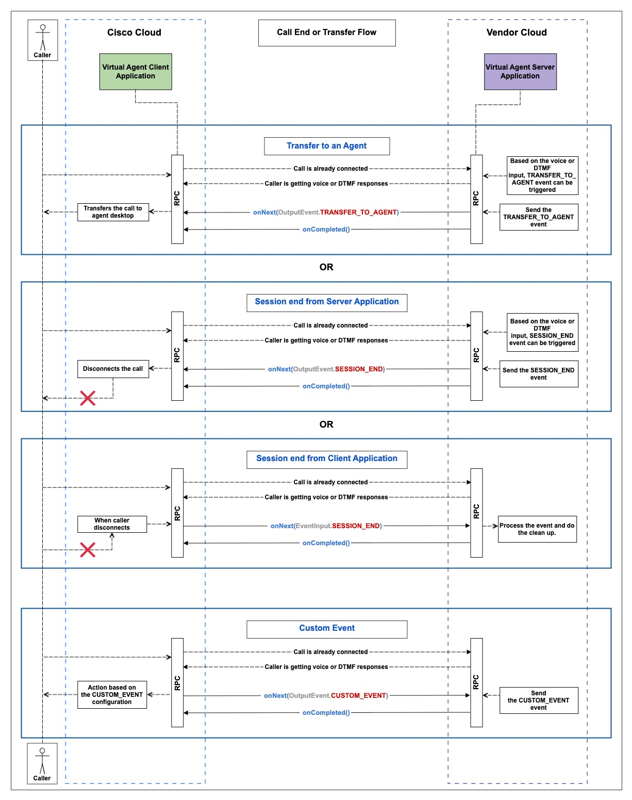

# Webex Contact Center Provider Sample Code

[](https://openjdk.java.net/projects/jdk/17/)
[](https://maven.apache.org/)

> Sample code and implementation guide for integrating with Webex Contact Center Media Service APIs

This repository provides sample implementations and comprehensive documentation for integrating with Webex Contact Center's Media Service APIs. It includes support for Bring Your Own Virtual Agent (BYoVA) and Real-Time Media Forking capabilities.

## Table of Contents

- [Background](#background)
- [Install](#install)
- [Usage](#usage)
- [API](#api)
- [Examples](#examples)
- [Troubleshooting](#troubleshooting)
- [Contributing](#contributing)
- [License](#license)

## Background

Webex Contact Center Media Service APIs provide interfaces to handle media-related use cases for platform consumers. The platform offers two main services:

1. **BYoVA (Bring Your Own Virtual Agent)** - Integrate external virtual agents within Webex Contact Center platform via gRPC communication
2. **Real-Time Media Forking** - Register URLs to receive forked audio from agent-caller conversations


### Bring Your Own Virtual Agent (BYoVA)

The Bring Your Own Virtual Agent initiative empowers developers and AI vendors to seamlessly integrate external conversational interfaces (like BOTs) with Webex Contact Center IVR.

#### What is a Voice Virtual Agent?

A voice virtual agent connects to callers and performs the following actions:

- Transcribes caller **speech to text** for AI processing
- Utilizes **Natural Language Understanding** to identify caller intent
- Maps identified **intent** to existing workflows OR uses **Generative AI** to create responses
- Converts generated **text to speech** for caller interaction
- Provides human agents with context through transcripts or summaries for escalated calls
- Captures post-call data (Call Handled Time, Resolution, Intent, etc.) in Webex Analyzer


**Communication Protocol:** gRPC  
**Proto Definition:** `voiceVirtualagent.proto` (located at `dialog-connector-simulator/src/main/proto/com/cisco/wcc/ccai/media/v1`)

### Real-Time Media Forking

Media forking allows customers and partners to receive forked audio from human agent-caller interactions at registered external URLs.

**Communication Protocol:** gRPC  
**Proto Definition:** `conversationAudioForking.proto` (located at `dialog-connector-simulator/src/main/proto/com/cisco/wcc/ccai/media/v1`)

## Install

### Prerequisites

1. **Java 17 or higher**
   ```bash
   java -version
   ```

2. **Apache Maven**
   ```bash
   mvn --version
   ```
   
   If not installed:
   ```bash
   # macOS
   brew install maven
   
   # Ubuntu/Debian
   sudo apt-get install maven
   
   # CentOS/RHEL
   sudo yum install maven
   ```

3. **Set JAVA_HOME (if needed)**
   ```bash
   export JAVA_HOME=$(/usr/libexec/java_home -v 17)  # macOS
   ```

### Build and Run

1. **Navigate to the simulator directory:**
   ```bash
   cd media-service-api/dialog-connector-simulator
   ```

2. **Build the application:**
   ```bash
   mvn clean install
   ```

3. **Run the server:**
   ```bash
   java -jar target/dialog-connector-simulator-1.0.0-SNAPSHOT-allinone.jar
   ```

   Expected output:
   ```
   2025-07-31 14:55:49 INFO  GrpcServer:37 - server started at port : 8086
   ```

## Usage

### Local Development Setup

For integration with Webex Contact Center, your local server needs HTTPS access. Use **ngrok** to create a secure tunnel:

1. **Install ngrok:**
   ```bash
   # macOS
   brew install ngrok
   
   # Or download from https://ngrok.com/download
   ```

2. **Start the ngrok tunnel** (in a separate terminal):
   ```bash
   ngrok http --upstream-protocol=http2 8086
   ```

3. **Copy the HTTPS URL** from ngrok output:
   ```
   Forwarding  https://abc123.ngrok-free.app -> http://localhost:8086
   ```

### Configuration

Edit `media-service-api/dialog-connector-simulator/src/main/resources/config.properties`:

```properties
# Update with your ngrok HTTPS URL
DATASOURCE_URL = https://your-ngrok-id.ngrok-free.app

# Server settings (usually no changes needed)
API_URL = localhost
PORT = 8086
USE_TLS = false

# Audio settings
AUDIO_ENCODING_TYPE = MULAW
SAMPLE_RATE_HERTZ = 8000
LANGUAGE_CODE = en-US
```

**Important:** The `DATASOURCE_URL` must match your ngrok HTTPS URL for Webex Contact Center integration.

### Key Concepts

#### Data Source
The communication endpoint between Webex Contact Center and Virtual Agent application/Media Forking server running on vendor's cloud.

#### Bring Your Own Data Source (BYoDS)
Framework for registering communication endpoints with Webex. Partners/Customers use BYoDS APIs to register their **Data Source**.  
[Documentation](https://developer.webex.com/webex-contact-center/docs/api/v1/data-sources/register-a-data-source)

#### Service Apps
Integration framework used by BYoVA to register communication endpoints with Webex. Service apps enable admin permission requests for Webex Contact Center REST APIs, reducing single-user dependencies.  
[Developer Portal](https://developer.webex.com/admin/docs/service-apps)

#### Config and Flow
- **Config**: Platform integration where partners/customers configure their integrations, linked to service apps and data sources
- **Flow**: Business/activity flows created via [Control Hub](https://admin.webex.com/wxcc/customer-experience/routing-flows/flows)

### Supported Audio Configurations

- **Format**: WAV
- **Sampling Rate**: 16kHz/8kHz  
- **Language**: en-US
- **Encoding**: Linear16/mulaw
- **Channels**: Single channel only

### gRPC Streaming Guidelines

1. `onNext`, `onError`, and `onCompleted` are gRPC methods from [StreamObserver<T>](https://grpc.github.io/grpc-java/javadoc/io/grpc/stub/StreamObserver.html). Method names vary by language implementation.

2. For each RPC, `onCompleted` is called from VA Client after sending all data (half-closed). VA Server must call `onCompleted` to fully close the RPC.

3. Each RPC must be closed with `onCompleted` except during unexpected termination scenarios.

### Service App Setup

1. **Create Service App**  
   Visit the [Developer Portal](https://developer.webex.com/admin/docs/service-apps) to create a service app.

2. **Submit for Approval**  
   Service app requires org admin approval after creation.
   

3. **Admin Approval**  
   Org admin evaluates `validDomains` in [Control Hub](https://admin.webex.com/apps/serviceapps) and approves if validated.
   

### Data Source Registration

1. **Generate Tokens**  
   After service app authorization, generate token pair (access + refresh tokens) from developer portal.
   

2. **Register Data Source**  
   Register via [Developer Portal](https://developer.webex.com/webex-contact-center/docs/api/v1/data-sources) or API:

   ```bash
   curl --request POST \
        --url https://webexapis.com/v1/dataSources \
        --header 'Accept: application/json' \
        --header 'Authorization: Bearer YOUR_TOKEN' \
        --header 'Content-Type: application/json' \
        --data '{
          "schemaId": "5397013b-7920-4ffc-807c-e8a3e0a18f43",
          "url": "example.com/url1",
          "audience": "audience", 
          "subject": "VA",
          "nonce": "65793b88-ad6e-4ec8-929e-b408038251e3",
          "tokenLifeMinutes": "1440"
        }'
   ```

## Examples

### BYoVA Implementation

The Dialog Connector Simulator demonstrates a complete **gRPC Server Application** (`src/main/java/com/cisco/wccai/grpc/server/GrpcServer.java`) that handles requests from Webex Contact Center.

Key implementation files:
- **Server**: `src/main/java/com/cisco/wccai/grpc/server/VoiceVAImpl.java`
- **Client**: `src/main/java/com/cisco/wccai/grpc/client/VoiceVAClient.java`
- **Proto Schema**: [Voice Virtual Agent Schema](https://github.com/webex/dataSourceSchemas/tree/main/Services/VoiceVirtualAgent_5397013b-7920-4ffc-807c-e8a3e0a18f43/Proto)

#### Session Start Flow

```java
// Client sends SESSION_START
requestObserver.onNext(VoiceVARequest
    .newBuilder()
    .setEventInput(EventInput
        .newBuilder()
        .setEventType(EventInput.EventType.SESSION_START)
        .build())
    .setConversationId(conversationId)
    .build());
requestObserver.onCompleted();
```

#### Audio Response Flow

```java
// Server sends audio prompt response
Prompt prompt = Prompt.newBuilder()
    .setText(text)
    .setAudioContent(ByteString.copyFrom(audioBytes))
    .setIsBargeInEnabled(bargeInEnabled)
    .build();

VoiceVAResponse response = VoiceVAResponse.newBuilder()
    .addPrompts(prompt)
    .addOutputEvents(OutputEvent.newBuilder()
        .setEventType(OutputEvent.EventType.END_OF_INPUT)
        .build())
    .build();

responseObserver.onNext(response);
responseObserver.onCompleted();
```

#### Transfer to Agent

```java
// Send TRANSFER_TO_AGENT event (triggered by DTMF "9" in simulator)
VoiceVAResponse transferResponse = VoiceVAResponse.newBuilder()
    .addOutputEvents(OutputEvent.newBuilder()
        .setEventType(OutputEvent.EventType.TRANSFER_TO_AGENT)
        .build())
    .build();
responseObserver.onNext(transferResponse);
responseObserver.onCompleted();
```

### Media Forking Implementation

The Dialog Connector includes Media Forking capabilities for real-time agent-caller audio access.

**Server Implementation**: `src/main/java/com/cisco/wccai/grpc/server/ConversationAudioForkImpl.java`  
**Proto Schema**: `src/main/proto/com/cisco/wcc/ccai/media/v1/conversationaudioforking.proto`

### Health Check Endpoint

Each provider endpoint should expose health monitoring APIs:

```
GET https://<Service-Endpoint>/<Service-Name>/v1/ping
```

Response:
```json
{
  "serviceName": "<Service Name>",
  "serviceType": "REQUIRED", 
  "serviceState": "online",
  "message": "<Service Name> is ONLINE",
  "lastUpdated": "2021-01-22T12:24:37.382Z"
}
```

See `src/main/proto/com/cisco/wcc/ccai/v1/health.proto` for the health check protocol definition.

## Troubleshooting

### Build Issues

**Protobuf Generation Errors**  
If you encounter "cannot find symbol" errors for `VoiceVirtualAgentGrpc` or `ConversationAudioGrpc` classes:
```
{
  "schemaId": "5397013b-7920-4ffc-807c-e8a3e0a18f43",
  "url": "example.com/url1",
  "audience": "audience",
  "subject": "VA",
  "nonce": "65793b88-ad6e-4ec8-929e-b408038251e3",
  "tokenLifeMinutes": "1440"
}
```
Sample response-
```
{
    "id": "f0a84d12-2760-4610-8c84-719a622f4748", // data source id
    "schemaId": "5397013b-7920-4ffc-807c-e8a3e0a18f43", // VA schema id
    "orgId": "63b02f90-9cc6-43b8-aa6d-cad425ac554c", //org uuid
    "applicationId": "Cf2e954e018f2de8c1403e2618323551df65", //service app id
    "status": "active", // data source is active or not
    "jwsToken": "eyJhbGciOiJIUzI1NiJ9.eyJzdWIiOiJzdWJqZWN0", //signed jwt(signed with cisco's private key)
    "createdBy": "3e4d3b27-1bf1-4916-8d0c-d27fd765fa52", ///created by
    "createdAt": "2024-05-20T15:50:06.754103" // created at
}
```
4. Store the JWS included in the response as this will be sent by contact center client at the time of communication.
**Note** - It is responsibility of the customer to keep refreshing the data source via PUT API. If the data source is expired(post token life time expiry), the communication will stop working.Refer [link](https://developer.webex.com/webex-contact-center/docs/api/v1/data-sources/update-a-data-source) for more details on API.

### Config and flow creation
1. Once the service app is created and authorized, admin needs to go to [integrations/features](https://admin.webex.com/wxcc/integrations/features) section of Control hub and create a new feature/config by selecting the authorized service app.

- Use the “Virtual Agent Activity” in the flow designer to select the virtual agent and configure the routing logic of your workflow.*
- Use "media forking" activity in the flow designer to configure media forking flow.
   
2. Map the EntryPoint to the newly created flow (EntryPoint -> Routing Strategy -> Flow).

## JWS validation while gRPC connection
1. Contact center client/Flow will initiate a gRPC connection with Virtual agent(server), using JWS.
Virtual agent service will validate the jws by fetching public key from cisco and matching the key id.
**Sample code for public key fetching**
```
{
    int responseCode = httpClient.getResponseCode();
        if (responseCode == HttpURLConnection.HTTP_OK) {
            try (InputStream inputStream = httpClient.getInputStream()) {
                byte[] responseBytes = inputStream.readAllBytes();
                String response = new String(responseBytes);
                ObjectMapper objectMapper = new ObjectMapper();
                var publicKeyResponse = objectMapper.readValue(response, PublicKeyResponse.class);//PublicKeyResponse has key
                return publicKeyResponse;
            }
        }
}
```
**Sample code for JWS verification**
```
 private boolean validateJWT(String jwtString, String jwkString) throws JOSEException, ParseException {
        JWK jwk = JWK.parse(jwkString);//public key fetched
        RSAPublicKey publicKey = (RSAPublicKey) jwk.toRSAKey().toPublicKey();
        SignedJWT signedJWT = SignedJWT.parse(jwtString);
        JWSVerifier verifier = new RSASSAVerifier(publicKey);
        boolean verified = signedJWT.verify(verifier);
        if (verified) {
            LOGGER.info("JWT is valid!");
            return true;
        } else {
            LOGGER.info("JWT is invalid!");
            return false;
        }
    }
```
For more detailed detailed implementation of the JWs validation, please refer `src/main/java/com/cisco/wccai/grpc/server/interceptors/JWTAuthorizationHandler.java`


# Getting started with BYoVA <a name="byova-getting-started-section"></a>

## Use cases <a name="communication-section"></a>
The communication between contact center and Virtual agent will happen over gRPC.
Contact center will work as client and Virtual agent application on the vendor's cloud will be the server.
[Schema defintions](https://github.com/webex/dataSourceSchemas/tree/main/Services) of each use case will point to the respective proto defintions(as uri).
Virtual agent application/server needs to implement their logic adhering to these proto defintions.
For example virtual agent proto defintions can be found [here](https://github.com/webex/dataSourceSchemas/tree/main/Services/VoiceVirtualAgent_5397013b-7920-4ffc-807c-e8a3e0a18f43/Proto)

Here,the Dialog Connector represents a sample **gRPC Server Application**(see `src/main/java/com/cisco/wccai/grpc/server/GrpcServer.java`) that listens for incoming requests from the
Webex CC VA Client Application which is a sample **gRPC Client Application**(see `src/main/java/com/cisco/wccai/grpc/client/VoiceVAClient.java`).
To refer sample virtual agent side of code please [refer](./media-service-api/dialog-connector-simulator/src/main/java/com/cisco/wccai/grpc/server/VoiceVAImpl.java)

### Sending audio over gRPC
Once the gRPC connection is established and JWS validation is done, client will send SESSION_START to communicate server about the session.
### Start of Conversation
This use case is explained in this [file](./media-service-api/dialog-connector-simulator/README.md) in the section **Start of conversation**.

**Sample code to send session start from client**
Sample code for client side SESSION_START implementation is included [here](https://github.com/CiscoDevNet/webex-contact-center-provider-sample-code/blob/13875585c92b7b669ce2e02c51f33e3774944a2e/media-service-api/dialog-connector-simulator/src/main/java/com/cisco/wccai/grpc/client/VoiceVAClientImpl.java#L78C23-L78C54)

**Sample code to send audio prompt as response from Virtual agent/Server**
```
{
    Prompt prompt = Prompt.newBuilder()
                .setText(text)
                .setAudioContent(Bytes[])//actual audio bytes
                .setIsBargeInEnabled(barginEnabled)
                .build();
    var requestObserver = audioVirtualAgentBlockingStub.processCallerInput(streamObserver);
    VoiceVAResponse result = VoiceVAResponse.newBuilder()
                .addPrompts(prompt)
                .addOutputEvents(getOutputEvent(ByovaCommon.OutputEvent.EventType.END_OF_INPUT))
                .build();
        return result;
    voiceVAResponse.onNext(result);
    requestObserver.onCompleted();
}
```

### Caller and Virtual agent interaction flow
1. Once the SESSION_START event is sent, server is informed that call is started.
2.. Post this actual flow can be started and any audio, DTMF or call event can be sent.

**Sample code for server to handle audio of caller**
```
{
    //send START_OF_INPUT event
    voiceVAResponse startOfInputResponse = VoiceVAResponse
                .newBuilder()
                .addOutputEvents(ByovaCommon.OutputEvent.newBuilder().setEventType(START_OF_INPUT).build();)
                .build();
    voiceVAResponse.onNext(startOfInputResponse);
    //Client will send caller audio in chunks or as full stream, then on silence detection server should send END_OF_INPUT
    //send END_OF_INPUT
     voiceVAResponse startOfInputResponse = VoiceVAResponse
                .newBuilder()
                .addOutputEvents(ByovaCommon.OutputEvent.newBuilder().setEventType(END_OF_INPUT).build();)
                .build();
    voiceVAResponse.onNext(startOfInputResponse);
    //Client will send onComplete and on receiving onComplete with Prompt or list of Prompts
    Prompt prompt = Prompt.newBuilder()
                .setText(text)
                .setAudioContent(Bytes[])
                .setIsBargeInEnabled(barginEnabled)
                .build();
    var requestObserver = audioVirtualAgentBlockingStub.processCallerInput(streamObserver);
    VoiceVAResponse result = VoiceVAResponse.newBuilder()
                .addPrompts(prompt)
                .addOutputEvents(getOutputEvent(ByovaCommon.OutputEvent.EventType.END_OF_INPUT))
                .addResponseType(FINAL)
                .build();
        return result;
    voiceVAResponse.onNext(result);
    requestObserver.onCompleted();
}
```

### DTMF flow
This use case is explained in this [file](./media-service-api/dialog-connector-simulator/README.md) in the section **DTMF input flow**.

Sample code of client side sending DTMF data is implementated here `https://github.com/CiscoDevNet/webex-contact-center-provider-sample-code/blob/13875585c92b7b669ce2e02c51f33e3774944a2e/media-service-api/dialog-connector-simulator/src/main/java/com/cisco/wccai/grpc/client/VoiceVAClientImpl.java#L51`

```
{
    //Client will send START_OF_DTMF
    requestObserver.onCompleted(); //send onComplete on receiving this

    //Client will send END_OF_DTMF
    requestObserver.onCompleted(); //send onComplete on receiving this
    //Client will send final in the input event and on receiving this, play prompt of required
    Prompt prompt = Prompt.newBuilder()
                .setText(text)
                .setAudioContent(Bytes[])
                .setIsBargeInEnabled(barginEnabled)
                .build();
    var requestObserver = audioVirtualAgentBlockingStub.processCallerInput(streamObserver);
    VoiceVAResponse result = VoiceVAResponse.newBuilder()
                .addPrompts(prompt)
                .addOutputEvents(getOutputEvent(ByovaCommon.OutputEvent.EventType.END_OF_INPUT))
                .addResponseType(FINAL)
                .build();
        return result;
    voiceVAResponse.onNext(result);
    requestObserver.onCompleted();
}

```

### Audio Streaming
This use case is explained in this [file](./media-service-api/dialog-connector-simulator/README.md) in the section **Audio Input Flow**.

#### WAV audio streaming
This use case is explained in this [file](./media-service-api/dialog-connector-simulator/README.md) in the section **Wav Audio Streaming**.

#### Chunk audio streaming
This use case is explained in this [file](./media-service-api/dialog-connector-simulator/README.md) in the section **CHUNK Audio Streaming**.

#### Barge-In Prompts
This use case is explained in this [file](./media-service-api/dialog-connector-simulator/README.md) in the section **Barge-in Prompts**.


### Transfer to agent flow
Transfer to agent: An ongoing call with a virtual agent can be transferred to a live agent by sending the [TRANSFER_TO_AGENT](https://github.com/webex/dataSourceSchemas/blob/f625b9f80dd0673bc0da01f443e31104a1a66dbd/Services/VoiceVirtualAgent_5397013b-7920-4ffc-807c-e8a3e0a18f43/Proto/byova_common.proto#L153) output event, along with an optional audio prompt. 
Note: As per Dialogue connector simulator code dtmf digit "9" is used to initiate agent transfer flow from virtual agent.
Sample code for this is here `https://github.com/CiscoDevNet/webex-contact-center-provider-sample-code/blob/13875585c92b7b669ce2e02c51f33e3774944a2e/media-service-api/dialog-connector-simulator/src/main/java/com/cisco/wccai/grpc/server/VoiceVirtualAgentService.java#L67`
***Sample code for transfer to agent***
```
{
    //on receiving audio or dtmf input to transfer the call to agent, send TRANSFER_TO_AGENT as output event
    requestObserver.onCompleted(); //send onComplete on receiving this

    //Client will send END_OF_DTMF
     //send START_OF_INPUT event
    voiceVAResponse startOfInputResponse = VoiceVAResponse
                .newBuilder()
                .addOutputEvents(ByovaCommon.OutputEvent.newBuilder().setEventType(TRANSFER_TO_AGENT).build();)
                .build();
    requestObserver.onCompleted();
}
```

### Call end flow
1. Session end from server application: Call can be disconnected from the VA Server side by sending the [SESSION_END](https://github.com/webex/dataSourceSchemas/blob/f625b9f80dd0673bc0da01f443e31104a1a66dbd/Services/VoiceVirtualAgent_5397013b-7920-4ffc-807c-e8a3e0a18f43/Proto/byova_common.proto#L152) output event, along with an optional audio prompt. 
2. Session end from client application: When the caller disconnects the call, a [SESSION_END](https://github.com/webex/dataSourceSchemas/blob/f625b9f80dd0673bc0da01f443e31104a1a66dbd/Services/VoiceVirtualAgent_5397013b-7920-4ffc-807c-e8a3e0a18f43/Proto/byova_common.proto#L183) input event will be sent to the VA Server, and no prompt can be sent. 
Note: As per Dialogue connector simulator code dtmf digit "9" is used to initiate agent transfer flow from virtual agent.
Sample code for this is here `https://github.com/CiscoDevNet/webex-contact-center-provider-sample-code/blob/13875585c92b7b669ce2e02c51f33e3774944a2e/media-service-api/dialog-connector-simulator/src/main/java/com/cisco/wccai/grpc/server/VoiceVirtualAgentService.java#L68`
***Sample code for transfer to agent***
```
{
    //on receiving audio or dtmf input to transfer the call to agent, send TRANSFER_TO_AGENT as output event
    requestObserver.onCompleted(); //send onComplete on receiving this

    //Client will send END_OF_DTMF
     //send START_OF_INPUT event
    voiceVAResponse startOfInputResponse = VoiceVAResponse
                .newBuilder()
                .addOutputEvents(ByovaCommon.OutputEvent.newBuilder().setEventType(TRANSFER_TO_AGENT).build();)
                .build();
    requestObserver.onCompleted();
}
```


### Custom event flow
[CUSTOM_EVENT](https://github.com/webex/dataSourceSchemas/blob/f625b9f80dd0673bc0da01f443e31104a1a66dbd/Services/VoiceVirtualAgent_5397013b-7920-4ffc-807c-e8a3e0a18f43/Proto/byova_common.proto#L154) can be sent via flow or Virtual agent application. These custom events can be sent along with INPUT_EVENT(via flow) or OUTPUT_EVENT(via Virtual agent application.)

***Sample code for transfer to agent***
```
{
    ManagedChannel channel;
    channel = NettyChannelBuilder.forAddress("https://example.com/url1", 8080)//initiazing the channel
            .negotiationType(NegotiationType.PLAINTEXT)
            .idleTimeout(5, TimeUnit.SECONDS)
            .build();
    var streamObserver = new VoiceVAStreamObserver();//VoiceVirtualAgentResponse observer generated as per proto file
    VoiceVirtualAgentStub audioVirtualAgentBlockingStub; //VoiceVirtualagent proto stub(generated as per proto and initialized as per channel)
    VoiceVirtualAgentGrpc.VoiceVirtualAgentStub stub = VoiceVirtualAgentGrpc.newStub(channel);//stub initialization
    var requestObserver = audioVirtualAgentBlockingStub.processCallerInput(streamObserver);
    requestObserver.onNext(Voicevirtualagent.VoiceVARequest
                .newBuilder()
                .setEventInput(ByovaCommon.EventInput
                        .newBuilder()
                        .setEventType(ByovaCommon.EventInput.EventType.SESSION_START).build()
                        .setName("custom_param")
                        .setParam("departmentId"."02883"))
                .setConversationId(convoId)
                .build());
    requestObserver.onCompleted();
}
```


# Getting started with Media Forking <a name="starting-media-forking-section"></a>
This feature allows customers to access the media which is the real time interaction between the human agent and the caller in the Webex Contact Center.

Refer to the [Dialog Connector Simulator Sample Code](https://github.com/CiscoDevNet/webex-contact-center-provider-sample-code/tree/main/media-service-api/dialog-connector-simulator).
For the interface definition see `src/main/proto/com/cisco/wcc/ccai/media/v1/conversationaudioforking.proto`.

## Sample code
Here,the Dialog Connector represents a sample **gRPC Server Application**(see `src/main/java/com/cisco/wccai/grpc/server/GrpcServer.java`) that listens for incoming requests from the
To refer sample server side of code please [refer](./media-service-api/dialog-connector-simulator/src/main/java/com/cisco/wccai/grpc/server/ConversationAudioForkImpl.java)

## Serviceability <a name="serviceability-section"></a>
Each Provider endpoint to expose certain APIs to monitor the health of endpoint.
Each Provider endpoint should expose APIs to monitor the health of the endpoint. The APIs should return the status of the service.
Refer to the Check API in the health [proto](./media-service-api/dialog-connector-simulator/src/main/proto/com/cisco/wcc/ccai/v1/health.proto)
https://<Service endpoint>/<service Name>/v1/ping
Response:
```sh
{
"serviceName": "<Service Name>",
"serviceType": "REQUIRED",
"serviceState": "online",
"message": "<Service Name> is ONLINE",
"lastUpdated": "2021-01-22T12:24:37.382Z",
}
```

# Troubleshooting <a name="troubleshooting-section"></a>

## Build Issues

**Protobuf Generation Errors**  
If you encounter "cannot find symbol" errors for `VoiceVirtualAgentGrpc` or `ConversationAudioGrpc` classes:

1. Try the standard build process first:
   ```bash
   export JAVA_HOME=$(/usr/libexec/java_home -v 17)  # macOS
   mvn clean install
   ```

2. If the build still fails, run the protobuf generation explicitly:
   ```bash
   export JAVA_HOME=$(/usr/libexec/java_home -v 17)  # macOS
   cd media-service-api/dialog-connector-simulator
   mvn clean
   mvn protobuf:compile protobuf:compile-custom
   mvn compile
   ```

1. Try the standard build process first:
   ```bash
   export JAVA_HOME=$(/usr/libexec/java_home -v 17)  # macOS
   mvn clean install
   ```

2. If the build still fails, run the protobuf generation explicitly:
   ```bash
   export JAVA_HOME=$(/usr/libexec/java_home -v 17)  # macOS
   cd media-service-api/dialog-connector-simulator
   mvn clean
   mvn protobuf:compile protobuf:compile-custom
   mvn compile
   ```

**Java Version Mismatch**
If you encounter compilation errors:
1. Verify Java 17 is installed: `java -version`
2. Set JAVA_HOME explicitly:
   ```bash
   export JAVA_HOME=$(/usr/libexec/java_home -v 17)  # macOS
   mvn clean install
   ```
3. Check Maven is using correct Java version: `mvn --version`

## Runtime Issues

**JWT Claims Validation Failed**
- **Datasource URL Mismatch** (Most Common): Update `DATASOURCE_URL` in `config.properties` to match your current ngrok HTTPS URL
- **Missing Required JWT Claims**: Ensure your JWT token contains required claims (`iss`, `aud`, `sub`, `jti`, `com.cisco.datasource.url`)

**Connection Issues**
- **ngrok URL Changes**: Each time you restart ngrok, update the `DATASOURCE_URL` in your configuration
- **HTTPS Required**: Webex Contact Center requires HTTPS endpoints - local HTTP won't work
- **Port Conflicts**: Default port 8086 - change in `config.properties` if needed

**Server Won't Start**
1. Check port availability: `lsof -i :8086`
2. Verify JAR was built: `ls -la media-service-api/dialog-connector-simulator/target/*.jar`
3. Check Java version: Server requires Java 17+

# mTLS authentication support <a name="mtls-authentication-support-section"></a>
mTLS (Mutual TLS) is an extension of TLS (Transport Layer Security) that ensures both the `Webex CCAI` (client) and `Dialog Connector` (server) authenticate each other during communication. 
Unlike standard TLS, which only authenticates the `Dialog Connector` to the `Webex CCAI`, mTLS requires both parties to present and validate certificates, providing bidirectional authentication.
mTLS is used in this scenario to ensure secure communication and mutual authentication between the `Dialog Connector` and the `Webex CCAI`.

Refer to [wiki](mTLSAuthentication.md) for more details on mTLS authentication support. 

# References <a name="references-section"></a>
1. **Service apps** - https://developer.webex.com/admin/docs/service-apps
2. **Data Sources** - https://developer.webex.com/webex-contact-center/docs/api/v1/data-sources
3. **BYoVA** - https://developer.webex.com/webex-contact-center/docs/bring-your-own-virtual-agent
4. **Schema defintions** - https://github.com/webex/dataSourceSchemas/tree/main/Services
5. **Sample Code** -
The Dialog Connector Simulator is a sample code that demonstrates how to integrate an external conversational interface with Webex Contact Center IVR.
Refer to the [Dialog Connector Simulator Sample Code](https://github.com/CiscoDevNet/webex-contact-center-ai-sample-code/tree/main/provider-api/dialog-connector-simulator).
For the interface definition see `src/main/proto/com/cisco/wcc/ccai/media/v1/*`.
