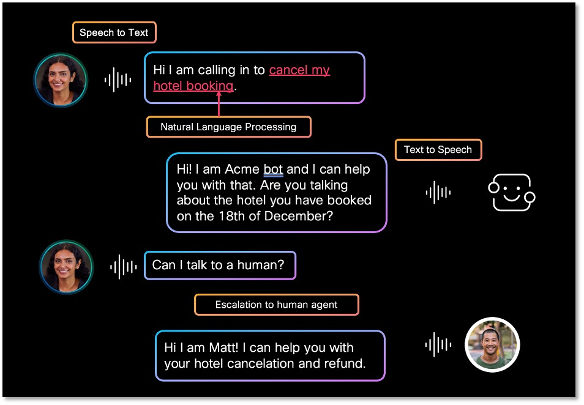
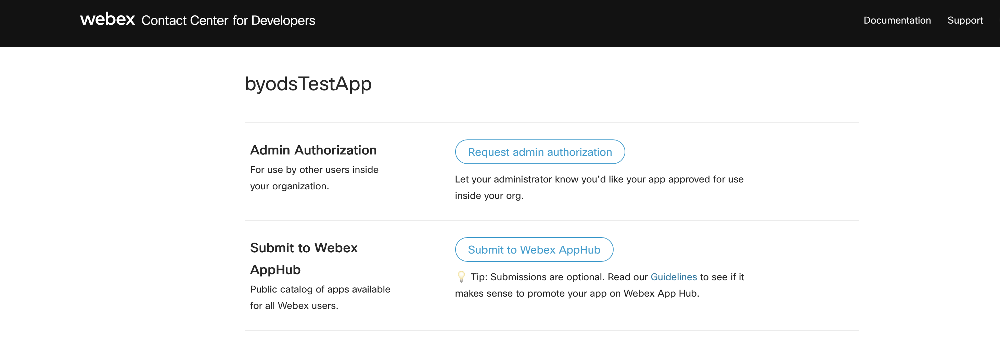
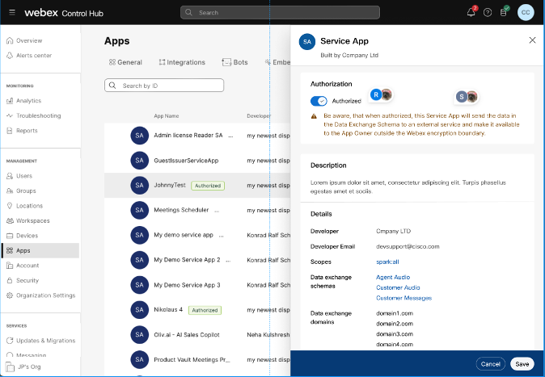
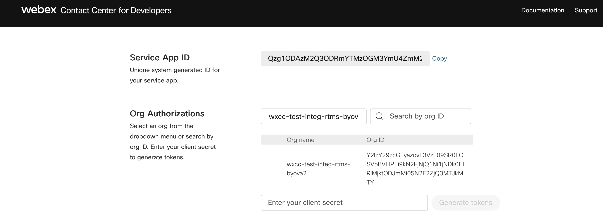
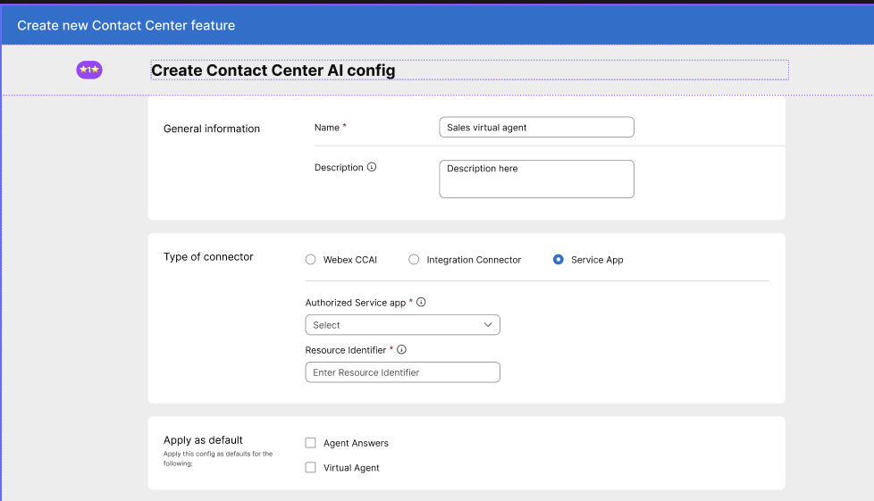

# Bring Your Own Virtual Agent (BYoVA)

The **Bring-Your-Own-Virtual-Agent (BYoVA)** initiative empowers developers and AI vendors to seamlessly integrate their own conversational interfaces (bots, IVR replacements, agent assistants, …) with the Webex Contact Center (WxCC) IVR. This directory contains everything you need to onboard a new BYoVA tenant and stand up a reference Virtual Agent server in the language and transport of your choice.

This README focuses on the parts of the journey that are **specific to virtual agents** — what a voice virtual agent does, the supported integration variants, how to onboard your service into Webex, how the runtime authentication contract (JWS) works, and the audio/configuration constraints every implementation must respect. The detailed gRPC streaming contract and per-event call-flow walkthroughs live in the interface-specific [README](./grpc-interface/README.md), and the broader Media Service APIs context lives in the [main README](../../README.md).

## Table of Contents

- [What Is a Voice Virtual Agent?](#what-is-a-voice-virtual-agent)
- [Integration Variants in This Directory](#integration-variants-in-this-directory)
- [Audio & Runtime Constraints](#audio--runtime-constraints)
- [Onboarding a New Customer / Partner](#onboarding-a-new-customer--partner)
    - [Step 1. Create and Authorize a Service App](#step-1-create-and-authorize-a-service-app)
    - [Step 2. Generate Service-App Tokens](#step-2-generate-service-app-tokens)
    - [Step 3. Register a Data Source](#step-3-register-a-data-source)
    - [Step 4. Create a BYoVA Config (Feature) and Flow](#step-4-create-a-byova-config-feature-and-flow)
- [Runtime Authentication: JWS Validation](#runtime-authentication-jws-validation)
- [Operational Considerations](#operational-considerations)
- [Where to Go Next](#where-to-go-next)
- [References](#references)

---

## What Is a Voice Virtual Agent?

A voice virtual agent is the conversational endpoint that picks up a contact-centre call when the IVR routes the caller to it. At a high level, every BYoVA server is expected to:

- Transcribe the caller's **speech to text** for AI processing (ASR).
- Use **Natural Language Understanding** (or an LLM) to detect the caller's intent.
- Map the intent to a workflow, fulfil it, or generate a free-form response.
- Convert the generated **text to speech** (TTS) and play it back to the caller as audio prompts.
- Optionally **escalate to a human agent** with conversation context (transcript or summary).
- Emit post-call data (handle time, intent, resolution, …) so it surfaces in Webex Analyzer.



*Fig 1: A sample virtual agent call that is escalated to a human agent.*

## Integration Variants in This Directory

WxCC supports two transport protocols for BYoVA — gRPC (Protobuf) and WebSocket (JSON). The table below maps each combination to the reference implementation in this directory. Both variants implement the same conceptual contract (session start, audio in/out, DTMF, events, transfer, end); they just differ in transport and serialization.

| Transport | Schema | Interface directory |
|---|---|---|
| **gRPC** (each interaction carried on its own short-lived RPC) | Protobuf | [`grpc-interface/`](./grpc-interface/) |
| **WebSocket** (A single persistent connection for a conversation) | JSON | [`web-socket-interface/`](./web-socket-interface/) |

Each interface directory contains its own `README.md` (call-flow walkthrough, sequence diagrams, framing rules) alongside a `simulators/` folder with the runnable reference servers — open the directory link to browse both side by side.

## Audio & Runtime Constraints

Independent of the transport you pick, the WxCC client and any BYoVA server must agree on these audio characteristics:

- **Audio format:** WAV (or raw PCM — see below).
- **Sample rate:** 8 kHz or 16 kHz.
- **Channels:** mono (single channel).
- **Encoding:** Linear16 or G.711 µ-law.
- **Language code:** `en-US` (additional locales are added per release — confirm in your tenant's documentation).

The full event grammar, the protobuf field definitions, and per-step sequence diagrams are documented under each interface directory (start with [`grpc-interface/README.md`](./grpc-interface/README.md)).

---

## Onboarding a New Customer / Partner

The Webex side of the integration is set up via the developer / control-hub portals. There are four sequential steps; you only need to do them once per tenant.

### Step 1. Create and Authorize a Service App

A **Service App** is the integration framework BYoVA uses to register your communication endpoint with Webex. It lets you request admin permission to call the [Bring Your Own Data Source (BYoDS)](https://developer.webex.com/webex-contact-center/docs/api/v1/data-sources/register-a-data-source) APIs on behalf of an org, without depending on any single user's auth grant.

1. Sign in to the [Webex Developer Portal](https://developer.webex.com/admin/docs/service-apps) and create a new service app. Make sure the **valid domains** you list cover every FQDN your VA server will be reachable on.
2. Submit the app for org-admin approval.

   

3. The org admin reviews the submitted valid domains in [Control Hub → Apps → Service Apps](https://admin.webex.com/apps/serviceapps) and approves the app once they are validated.

   

> **Tip:** For the full service-app reference, see [developer.webex.com/admin/docs/service-apps](https://developer.webex.com/admin/docs/service-apps).

### Step 2. Generate Service-App Tokens

Once the service app is authorized, go to the **My Apps** section of the developer portal, open the app, pick the authorized org from the dropdown, and generate a token pair.



The pair contains:

- An **access token** — valid for **14 days**, used as the bearer token on every BYoDS API call.
- A **refresh token** — valid for **90 days**, used to mint new access tokens before expiry. See [Using the Refresh Token](https://developer.webex.com/create/docs/integrations#using-the-refresh-token) for the renewal flow.

> **Important:** Store both tokens in a secret manager (Vault / KMS / Secret Manager / equivalent). They authorize all subsequent data-source operations — treat them like passwords.

### Step 3. Register a Data Source

A **Data Source** is the external URL Webex will use to reach your VA server (over gRPC or WebSocket, depending on the variant). It must resolve to a host that is part of the `validDomains` list you provided when the service app was created.

You can register a data source either through the developer portal UI ([here](https://developer.webex.com/webex-contact-center/docs/api/v1/data-sources)) or directly via the REST API:

```bash
curl --request POST \
     --url https://webexapis.com/v1/dataSources \
     --header 'Accept: application/json' \
     --header 'Authorization: Bearer <SERVICE_APP_ACCESS_TOKEN>' \
     --header 'Content-Type: application/json' \
     --data '{
       "schemaId": "5397013b-7920-4ffc-807c-e8a3e0a18f43",
       "url": "https://va.example.com/your-endpoint",
       "audience": "audience",
       "subject": "VA",
       "nonce": "65793b88-ad6e-4ec8-929e-b408038251e3",
       "tokenLifeMinutes": "1440"
     }'
```

A successful response looks like:

```json
{
    "id": "f0a84d12-2760-4610-8c84-719a622f4748",
    "schemaId": "5397013b-7920-4ffc-807c-e8a3e0a18f43",
    "orgId": "63b02f90-9cc6-43b8-aa6d-cad425ac554c",
    "applicationId": "Cf2e954e018f2de8c1403e2618323551df65",
    "status": "active",
    "jwsToken": "eyJhbGciOiJIUzI1NiJ9.eyJzdWIiOiJzdWJqZWN0",
    "createdBy": "3e4d3b27-1bf1-4916-8d0c-d27fd765fa52",
    "createdAt": "2024-05-20T15:50:06.754103"
}
```

A few key fields:

- **`schemaId`** — `5397013b-7920-4ffc-807c-e8a3e0a18f43` is the published schema ID for the BYoVA `VoiceVirtualAgent` service. Use exactly this value for every voice-VA data source.
- **`url`** — the public endpoint of your VA server. For local development, expose your laptop via a tunnel (e.g. ngrok) and use the tunnel URL.
- **`tokenLifeMinutes`** — controls how long the issued JWS stays valid. Tune this to match your security policy and SLA.
- **`jwsToken`** — the signed JWT Webex will present to your VA server on every call (see [JWS validation](#runtime-authentication-jws-validation) below). Persist this — your server needs to recognize it.

> **Important:** It is the customer's responsibility to keep the data source alive. Use the [Update Data Source](https://developer.webex.com/webex-contact-center/docs/api/v1/data-sources/update-a-data-source) `PUT` API to refresh the JWS before it expires; if the data source goes inactive, all calls into your VA server will start failing.

### Step 4. Create a BYoVA Config (Feature) and Flow

Finally, link the authorized service app into a Contact Center configuration so flow designers can pick it.

1. In Control Hub, go to [Integrations → Features](https://admin.webex.com/wxcc/integrations/features) and create a new BYoVA feature, selecting the authorized service app from the dropdown.

   

2. In the [Flow Designer](https://admin.webex.com/wxcc/customer-experience/routing-flows/flows), open (or create) the routing flow that should hand the call off to your VA. Drop in the **Virtual Agent V2** activity, select the feature you just created, and configure the routing logic around it.
3. Map the entry point that fronts your IVR to this flow:
   `Entry Point → Routing Strategy → Flow`.

Once the entry point is mapped and the flow is published, calls landing on that entry point will be routed to your VA server using the data source registered in Step 3.

---

## Runtime Authentication: JWS Validation

For every call WxCC opens to your server, it presents the JWS issued at data-source registration time (in metadata for gRPC, or as an `Authorization` header for WebSocket). Your server **must** validate the JWS before processing the request.

The validation flow is:

1. Parse the incoming JWS (it's a standard signed JWT — header, payload, signature).
2. Read the `kid` (key ID) from the JOSE header.
3. Fetch Cisco's public keys from the JWKS endpoint and select the key whose ID matches `kid`.
4. Verify the signature against that key (RSA / RSASSA).
5. Verify the standard claims (`iss`, `aud`, `exp`, `nbf`, …) against your expected values.


For a complete reference implementation including JWKS retrieval, key caching, claim validation, and the gRPC `ServerInterceptor` that ties it all together, see the [virtual agent simulators](./grpc-interface/simulators/byova-multi-rpc-java/src/main/java/com/cisco/wccai/byova/grpc/AuthorizationServerInterceptor.java). The Python sample interceptor (`AuthInterceptor.py`) under each Python module shows the equivalent flow on that side.

> **Production checklist:**
> - Pin the JWS algorithm (e.g. RS256). Reject `none` and any algorithm you don't expect.
> - Cache the JWKS, but honour the `Cache-Control` headers — keys can rotate.
> - Always verify `exp` and (when present) `nbf` against the current UTC time with a small clock-skew tolerance (≤30 s).
> - Validate `iss` and `aud` against the values you used when registering the data source.

## Operational Considerations

A few things worth thinking about before you go live:

- **Health endpoint.** Each VA server should expose a health-check endpoint that the platform can ping. The reference shape (`/<service>/v1/ping`) is documented in the main [`README.md`](../../README.md#serviceability-section).
- **mTLS.** The platform supports mutual TLS for stronger transport-level authentication. See the [mTLS authentication support](../../README.md#mtls-authentication-support-section) section in the main README.
- **Secrets handling.** Service-app refresh tokens, the JWS, and any API keys for the upstream AI service must live in a managed secret store — never in source control or container images.
- **Observability.** Capture per-conversation correlation IDs (`conversation_id` in the proto, `conversationId` in the JSON schema) on every log line so you can trace a session end-to-end across WxCC and your VA stack.

## Where to Go Next

- Pick your transport / schema and read the corresponding interface README. The most fully-documented one today is [`grpc-interface/README.md`](./grpc-interface/README.md), which covers the full event-by-event call flow with sequence diagrams and is a good baseline even if you ultimately use a different variant.
- Read the proto definitions directly under [`webex/dataSourceSchemas`](https://github.com/webex/dataSourceSchemas/tree/main/Services/VoiceVirtualAgent_5397013b-7920-4ffc-807c-e8a3e0a18f43/Proto) — these are the source of truth for the wire contract.

## References

1. **BYoVA developer docs** — https://developer.webex.com/webex-contact-center/docs/bring-your-own-virtual-agent
2. **Service Apps** — https://developer.webex.com/admin/docs/service-apps
3. **BYoDS Data Sources API** — https://developer.webex.com/webex-contact-center/docs/api/v1/data-sources
4. **Schema definitions** — https://github.com/webex/dataSourceSchemas/tree/main/Services
5. **Refresh-token flow** — https://developer.webex.com/create/docs/integrations#using-the-refresh-token
