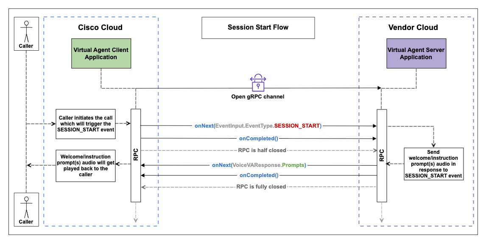
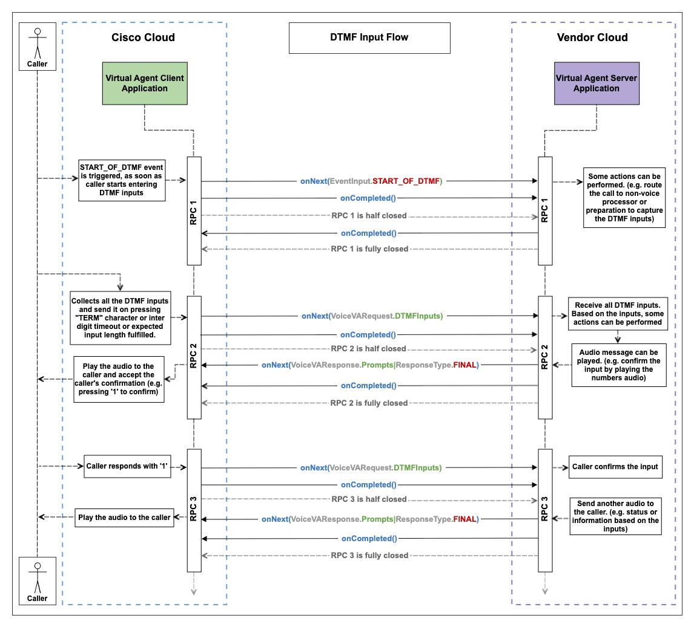
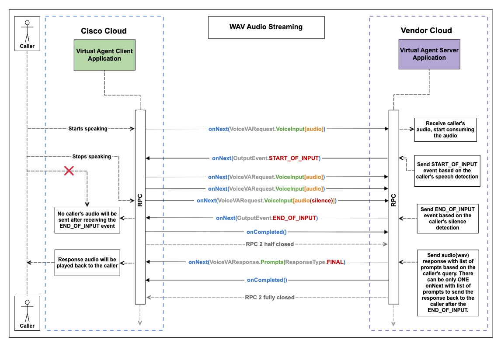
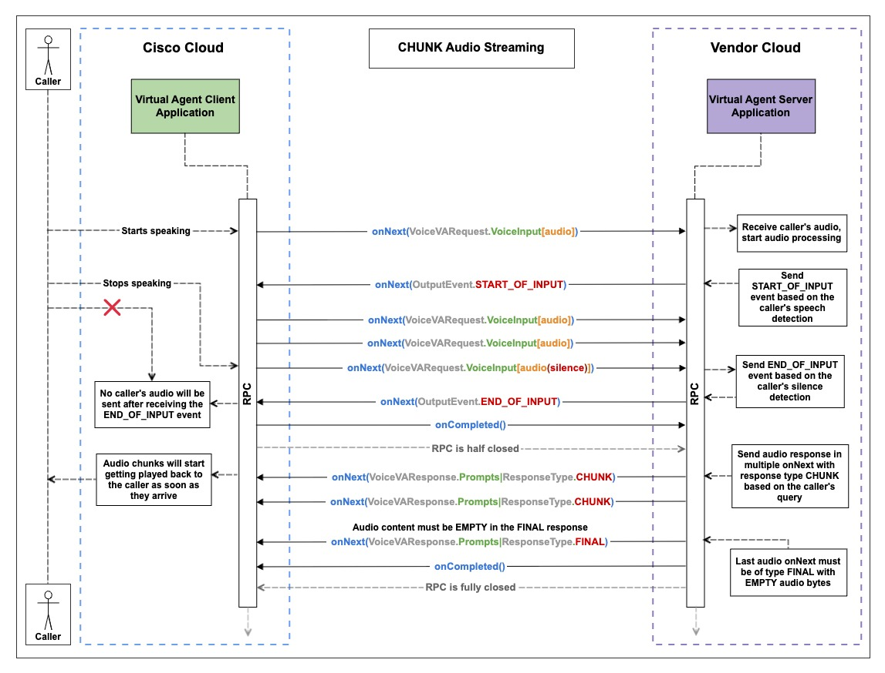
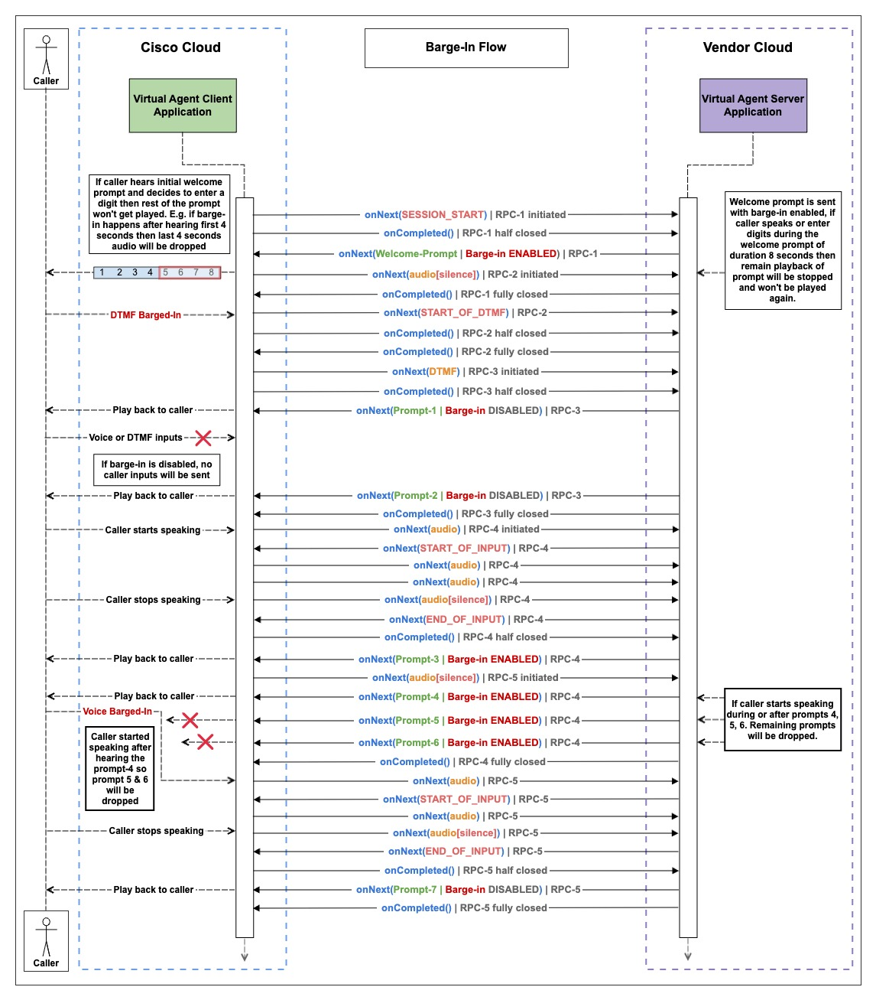
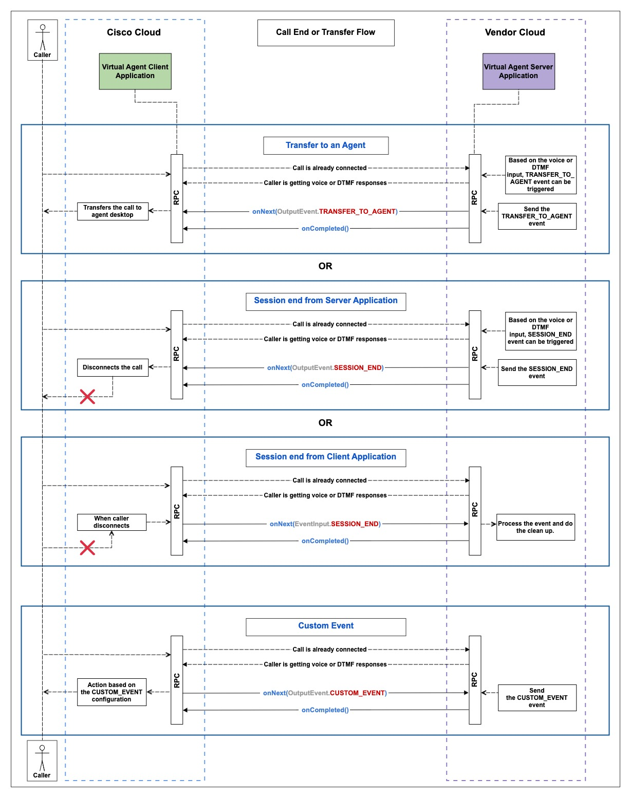

# Bring Your Own Virtual Agent — Multi-RPC (gRPC)

The Bring-Your-Own-Virtual-Agent (BYoVA) initiative empowers developers and AI vendors to seamlessly integrate external conversational interfaces with Webex Contact Center (WxCC). The **multi-RPC** flavour of the integration uses gRPC bidirectional streaming, where each logical interaction (welcome prompt, DTMF input, audio utterance, etc.) is carried on its own short-lived RPC instead of a single long-lived stream.

This document describes:

- The reference implementations (Java and Python) available under this directory.
- The [`VoiceVirtualAgent`](https://github.com/webex/dataSourceSchemas/tree/f625b9f80dd0673bc0da01f443e31104a1a66dbd/Services/VoiceVirtualAgent_5397013b-7920-4ffc-807c-e8a3e0a18f43/Proto) proto contract — defined by `voicevirtualagent.proto` and `byova_common.proto` — and the gRPC streaming guidelines that every BYoVA server must follow.
- Detailed call-flow walkthroughs (with sequence diagrams) for session start, DTMF, audio (WAV and CHUNK), barge-in, and call termination scenarios.

---

## Table of Contents

- [Virtual Agent Simulators](#virtual-agent-simulators)
- [gRPC Bi-directional Streaming Guidelines](#grpc-bi-directional-streaming-guidelines)
- [Virtual Agent Streaming and Event Handling Guidelines](#virtual-agent-streaming-and-event-handling-guidelines)
- [Detailed Flow with Sequence Diagrams](#detailed-flow-with-sequence-diagrams)
    - [Step 1. Start of Conversation](#step-1-start-of-conversation)
    - [Step 2. DTMF Input Flow](#step-2-dtmf-input-flow)
    - [Step 3. Audio Input Flow](#step-3-audio-input-flow)
        - [Step 3.1. WAV Audio Streaming](#step-31-wav-audio-streaming)
        - [Step 3.2. CHUNK Audio Streaming](#step-32-chunk-audio-streaming)
    - [Step 4. Barge-In Prompts](#step-4-barge-in-prompts)
    - [Step 5. Call Termination, Transfer, and Custom Event](#step-5-call-termination-transfer-and-custom-event)

---

## Virtual Agent Simulators

Each `byova-multi-rpc-*` directory is a self-contained reference server. They implement exactly the same `VoiceVirtualAgent` gRPC contract (`ProcessCallerInput` bidirectional stream + `ListVirtualAgents` unary RPC) so they are interchangeable from the WxCC client's point of view; pick whichever language is closer to your stack.

| Module | Stack | Get started |
|---|---|---|
| [`byova-multi-rpc-java/`](./byova-multi-rpc-java/) | Spring Boot 3 / Java 21, `grpc-java`, Maven; protos generated locally via `protobuf-maven-plugin`. | `./mvnw spring-boot:run` (port `8086`). See the [module README](./byova-multi-rpc-java/README.md) for prerequisites, configuration, Docker, and extension points. |
| [`byova-multi-rpc-python/`](./byova-multi-rpc-python/) | Python 3.10+, `grpcio` / `grpcio-tools`; protos fetched from upstream and generated on start-up. | `./run.sh` (port `8086`) handles venv, deps, proto fetch, codegen, and server start. See the [module README](./byova-multi-rpc-python/README.md) for manual setup, configuration, and Docker. |

## gRPC Bi-directional Streaming Guidelines

1. `onNext`, `onError`, and `onCompleted` are the gRPC methods defined on the [`StreamObserver<T>`](https://grpc.github.io/grpc-java/javadoc/io/grpc/stub/StreamObserver.html) interface for Java. The names of these methods and their signatures vary across language-specific gRPC libraries; refer to the [gRPC documentation](https://grpc.io/docs/languages/) for your language.
2. For each RPC, `onCompleted` will be called by the VA Client once it has finished sending data, which half-closes the RPC. Once the VA Server has finished sending all responses for the same RPC, it must call `onCompleted` to fully close it.
3. Every RPC must be terminated with `onCompleted` except in cases of unexpected call termination.

## Virtual Agent Streaming and Event Handling Guidelines

1. The sequence of events must follow the same order as outlined in the sequence diagrams below.
2. The welcome prompt must be sent in response to the [`SESSION_START`](https://github.com/webex/dataSourceSchemas/blob/f625b9f80dd0673bc0da01f443e31104a1a66dbd/Services/VoiceVirtualAgent_5397013b-7920-4ffc-807c-e8a3e0a18f43/Proto/byova_common.proto#L182) event.
3. Sending [`END_OF_INPUT`](https://github.com/webex/dataSourceSchemas/blob/f625b9f80dd0673bc0da01f443e31104a1a66dbd/Services/VoiceVirtualAgent_5397013b-7920-4ffc-807c-e8a3e0a18f43/Proto/byova_common.proto#L162) immediately stops the caller's audio streaming, so it should be sent only on silence detection from the caller. (This is **not** true if [barge-in](https://github.com/webex/dataSourceSchemas/blob/f625b9f80dd0673bc0da01f443e31104a1a66dbd/Services/VoiceVirtualAgent_5397013b-7920-4ffc-807c-e8a3e0a18f43/Proto/voicevirtualagent.proto#L123) is enabled.)
4. If the caller does not provide any input within the configured timeout, the [`NO_INPUT`](https://github.com/webex/dataSourceSchemas/blob/f625b9f80dd0673bc0da01f443e31104a1a66dbd/Services/VoiceVirtualAgent_5397013b-7920-4ffc-807c-e8a3e0a18f43/Proto/byova_common.proto#L185) event will be triggered.
5. Switching between Voice and DTMF is achieved by setting the desired [`INPUT_MODE`](https://github.com/webex/dataSourceSchemas/blob/f625b9f80dd0673bc0da01f443e31104a1a66dbd/Services/VoiceVirtualAgent_5397013b-7920-4ffc-807c-e8a3e0a18f43/Proto/voicevirtualagent.proto#L91) on the [`VoiceVAResponse`](https://github.com/webex/dataSourceSchemas/blob/f625b9f80dd0673bc0da01f443e31104a1a66dbd/Services/VoiceVirtualAgent_5397013b-7920-4ffc-807c-e8a3e0a18f43/Proto/voicevirtualagent.proto#L77). There are three input modes:
    - [`INPUT_VOICE`](https://github.com/webex/dataSourceSchemas/blob/f625b9f80dd0673bc0da01f443e31104a1a66dbd/Services/VoiceVirtualAgent_5397013b-7920-4ffc-807c-e8a3e0a18f43/Proto/voicevirtualagent.proto#L129) — only voice input is accepted.
    - [`INPUT_EVENT_DTMF`](https://github.com/webex/dataSourceSchemas/blob/f625b9f80dd0673bc0da01f443e31104a1a66dbd/Services/VoiceVirtualAgent_5397013b-7920-4ffc-807c-e8a3e0a18f43/Proto/voicevirtualagent.proto#L130) — only DTMF input is accepted.
    - [`INPUT_VOICE_DTMF`](https://github.com/webex/dataSourceSchemas/blob/f625b9f80dd0673bc0da01f443e31104a1a66dbd/Services/VoiceVirtualAgent_5397013b-7920-4ffc-807c-e8a3e0a18f43/Proto/voicevirtualagent.proto#L131) — both voice and DTMF inputs are accepted.

   If `INPUT_MODE` is not specified, [`INPUT_VOICE_DTMF`](https://github.com/webex/dataSourceSchemas/blob/f625b9f80dd0673bc0da01f443e31104a1a66dbd/Services/VoiceVirtualAgent_5397013b-7920-4ffc-807c-e8a3e0a18f43/Proto/voicevirtualagent.proto#L131) is used as the default.

## Detailed Flow with Sequence Diagrams

### Step 1. Start of Conversation

1. The Dialog Connector starts up as a gRPC Virtual Agent Server (**VA Server**).
2. When the caller's call is connected, the VA Client establishes a gRPC connection with the VA Server by creating a new conversation and sending a [`VoiceVARequest`](https://github.com/webex/dataSourceSchemas/blob/f625b9f80dd0673bc0da01f443e31104a1a66dbd/Services/VoiceVirtualAgent_5397013b-7920-4ffc-807c-e8a3e0a18f43/Proto/voicevirtualagent.proto#L16) carrying the `SESSION_START` event. The [`conversation_id`](https://github.com/webex/dataSourceSchemas/blob/f625b9f80dd0673bc0da01f443e31104a1a66dbd/Services/VoiceVirtualAgent_5397013b-7920-4ffc-807c-e8a3e0a18f43/Proto/voicevirtualagent.proto#L18) is reused for the entire conversation. This first request is sent without any audio data.
3. [`SESSION_START`](https://github.com/webex/dataSourceSchemas/blob/f625b9f80dd0673bc0da01f443e31104a1a66dbd/Services/VoiceVirtualAgent_5397013b-7920-4ffc-807c-e8a3e0a18f43/Proto/byova_common.proto#L182) can be used by the connector to start a session with its AI service and return a [`VoiceVAResponse`](https://github.com/webex/dataSourceSchemas/blob/f625b9f80dd0673bc0da01f443e31104a1a66dbd/Services/VoiceVirtualAgent_5397013b-7920-4ffc-807c-e8a3e0a18f43/Proto/voicevirtualagent.proto#L77) to the client. The response can include payloads, prompts, NLU data, and the input mode for the next interaction. Prompts contain the audio that will be played to the caller; one or more prompts can be returned in a single response and are played at the client side in the order received.
4. A new RPC is initiated with the [`SESSION_START`](https://github.com/webex/dataSourceSchemas/blob/f625b9f80dd0673bc0da01f443e31104a1a66dbd/Services/VoiceVirtualAgent_5397013b-7920-4ffc-807c-e8a3e0a18f43/Proto/byova_common.proto#L182) event of type [`EVENT_INPUT`](https://github.com/webex/dataSourceSchemas/blob/f625b9f80dd0673bc0da01f443e31104a1a66dbd/Services/VoiceVirtualAgent_5397013b-7920-4ffc-807c-e8a3e0a18f43/Proto/voicevirtualagent.proto#L41) from the VA Client to the VA Server.
5. Once the prompt has been sent, the VA Server should call `onCompleted`. The RPC is completed; a new RPC will be initiated to handle further events.

### Step 2. DTMF Input Flow

1. When the caller enters DTMF input by pressing keys on the phone keypad, a new RPC (RPC-1) is initiated with the [`START_OF_DTMF`](https://github.com/webex/dataSourceSchemas/blob/f625b9f80dd0673bc0da01f443e31104a1a66dbd/Services/VoiceVirtualAgent_5397013b-7920-4ffc-807c-e8a3e0a18f43/Proto/byova_common.proto#L186) event of type [`EVENT_INPUT`](https://github.com/webex/dataSourceSchemas/blob/f625b9f80dd0673bc0da01f443e31104a1a66dbd/Services/VoiceVirtualAgent_5397013b-7920-4ffc-807c-e8a3e0a18f43/Proto/voicevirtualagent.proto#L41) from the VA Client to the VA Server.
2. The [`START_OF_DTMF`](https://github.com/webex/dataSourceSchemas/blob/f625b9f80dd0673bc0da01f443e31104a1a66dbd/Services/VoiceVirtualAgent_5397013b-7920-4ffc-807c-e8a3e0a18f43/Proto/byova_common.proto#L186) event signals that the caller has begun entering DTMF inputs. Based on this event, specific actions can be taken, such as populating expected values or updating flags.
3. In response to the [`START_OF_DTMF`](https://github.com/webex/dataSourceSchemas/blob/f625b9f80dd0673bc0da01f443e31104a1a66dbd/Services/VoiceVirtualAgent_5397013b-7920-4ffc-807c-e8a3e0a18f43/Proto/byova_common.proto#L186) event, `onCompleted` should be called to complete RPC-1.
4. Once the caller has finished entering DTMF input, it is sent to the VA Server when one of the following conditions is met:
    - The [DTMF input length](https://github.com/webex/dataSourceSchemas/blob/f625b9f80dd0673bc0da01f443e31104a1a66dbd/Services/VoiceVirtualAgent_5397013b-7920-4ffc-807c-e8a3e0a18f43/Proto/byova_common.proto#L100) requirement is satisfied (the expected number of digits has been entered).
    - The [inter-digit timeout](https://github.com/webex/dataSourceSchemas/blob/f625b9f80dd0673bc0da01f443e31104a1a66dbd/Services/VoiceVirtualAgent_5397013b-7920-4ffc-807c-e8a3e0a18f43/Proto/byova_common.proto#L98) elapses.
    - The [termination character](https://github.com/webex/dataSourceSchemas/blob/f625b9f80dd0673bc0da01f443e31104a1a66dbd/Services/VoiceVirtualAgent_5397013b-7920-4ffc-807c-e8a3e0a18f43/Proto/byova_common.proto#L99) is pressed.
5. RPC-2 is initiated with the DTMF inputs, of type [`DTMF_INPUT`](https://github.com/webex/dataSourceSchemas/blob/f625b9f80dd0673bc0da01f443e31104a1a66dbd/Services/VoiceVirtualAgent_5397013b-7920-4ffc-807c-e8a3e0a18f43/Proto/voicevirtualagent.proto#L38).
6. The received DTMF inputs can be processed according to the use case. For example, an audio prompt asking the caller to confirm the entry by pressing `1` can be sent in `onNext` followed by `onCompleted`; RPC-2 is then completed.
7. The caller confirms the previously entered DTMF input by pressing `1`, and RPC-3 is initiated with that confirmation.
8. Another prompt (e.g. status or information based on the DTMF inputs) can be sent in response in `onNext` followed by `onCompleted`; RPC-3 is then completed.

### Step 3. Audio Input Flow

At the start of the call, the VA Server must choose between **WAV Streaming** and **CHUNK Streaming**; this decision must not change during the call. For scripted virtual agents where prompts are pre-configured the VA Server should use WAV streaming; for longer prompts produced by LLMs it should use CHUNK streaming.

- **WAV Streaming** — always send the response as [`FINAL`](https://github.com/webex/dataSourceSchemas/blob/f625b9f80dd0673bc0da01f443e31104a1a66dbd/Services/VoiceVirtualAgent_5397013b-7920-4ffc-807c-e8a3e0a18f43/Proto/voicevirtualagent.proto#L110) in a single `onNext`, with the WAV header included in the audio, followed by `onCompleted`.
- **CHUNK Streaming** — always send a [`FINAL`](https://github.com/webex/dataSourceSchemas/blob/f625b9f80dd0673bc0da01f443e31104a1a66dbd/Services/VoiceVirtualAgent_5397013b-7920-4ffc-807c-e8a3e0a18f43/Proto/voicevirtualagent.proto#L110) response with **empty** audio after all the [`CHUNK`](https://github.com/webex/dataSourceSchemas/blob/f625b9f80dd0673bc0da01f443e31104a1a66dbd/Services/VoiceVirtualAgent_5397013b-7920-4ffc-807c-e8a3e0a18f43/Proto/voicevirtualagent.proto#L112) responses, followed by `onCompleted`. The minimum [`CHUNK`](https://github.com/webex/dataSourceSchemas/blob/f625b9f80dd0673bc0da01f443e31104a1a66dbd/Services/VoiceVirtualAgent_5397013b-7920-4ffc-807c-e8a3e0a18f43/Proto/voicevirtualagent.proto#L112) size is 100 bytes and the maximum is 64 KB (65,536 bytes); keep chunks as large as possible up to that limit.

#### Step 3.1. WAV Audio Streaming

1. When the caller starts speaking, a new RPC is initiated with the caller's audio from the VA Client to the VA Server.
2. The VA Server must be capable of detecting both speech and silence in the caller's audio.
3. Once speech is detected, send the [`START_OF_INPUT`](https://github.com/webex/dataSourceSchemas/blob/f625b9f80dd0673bc0da01f443e31104a1a66dbd/Services/VoiceVirtualAgent_5397013b-7920-4ffc-807c-e8a3e0a18f43/Proto/byova_common.proto#L160) event in `onNext`.
4. Continue consuming caller audio until silence is detected.
5. Once silence is detected, send the [`END_OF_INPUT`](https://github.com/webex/dataSourceSchemas/blob/f625b9f80dd0673bc0da01f443e31104a1a66dbd/Services/VoiceVirtualAgent_5397013b-7920-4ffc-807c-e8a3e0a18f43/Proto/byova_common.proto#L162) event. (Sending [`END_OF_INPUT`](https://github.com/webex/dataSourceSchemas/blob/f625b9f80dd0673bc0da01f443e31104a1a66dbd/Services/VoiceVirtualAgent_5397013b-7920-4ffc-807c-e8a3e0a18f43/Proto/byova_common.proto#L162) immediately stops the caller's audio stream to the VA Server.)
6. The VA Server must wait for response generation to complete so that all responses can be sent in a single `onNext`. (The audio must include a WAV header for each `onNext`.)
7. Send all responses, either as one prompt or a list of prompts, with response type [`FINAL`](https://github.com/webex/dataSourceSchemas/blob/f625b9f80dd0673bc0da01f443e31104a1a66dbd/Services/VoiceVirtualAgent_5397013b-7920-4ffc-807c-e8a3e0a18f43/Proto/voicevirtualagent.proto#L110) in a single `onNext`, followed by `onCompleted`. The RPC is then completed. (More than one `onNext` is not permitted for [`FINAL`](https://github.com/webex/dataSourceSchemas/blob/f625b9f80dd0673bc0da01f443e31104a1a66dbd/Services/VoiceVirtualAgent_5397013b-7920-4ffc-807c-e8a3e0a18f43/Proto/voicevirtualagent.proto#L110) responses.)

#### Step 3.2. CHUNK Audio Streaming

1. When the caller starts speaking, a new RPC is initiated with the caller's audio from the VA Client to the VA Server.
2. The VA Server must be capable of detecting both speech and silence in the caller's audio.
3. Once speech is detected, send the [`START_OF_INPUT`](https://github.com/webex/dataSourceSchemas/blob/f625b9f80dd0673bc0da01f443e31104a1a66dbd/Services/VoiceVirtualAgent_5397013b-7920-4ffc-807c-e8a3e0a18f43/Proto/byova_common.proto#L160) event in `onNext`.
4. Continue consuming caller audio until silence is detected.
5. Once silence is detected, send the [`END_OF_INPUT`](https://github.com/webex/dataSourceSchemas/blob/f625b9f80dd0673bc0da01f443e31104a1a66dbd/Services/VoiceVirtualAgent_5397013b-7920-4ffc-807c-e8a3e0a18f43/Proto/byova_common.proto#L162) event. (Sending [`END_OF_INPUT`](https://github.com/webex/dataSourceSchemas/blob/f625b9f80dd0673bc0da01f443e31104a1a66dbd/Services/VoiceVirtualAgent_5397013b-7920-4ffc-807c-e8a3e0a18f43/Proto/byova_common.proto#L162) immediately stops the caller's audio stream to the VA Server.)
6. The VA Server does not need to wait for response generation to finish. Audio responses can be sent in multiple `onNext` calls with response type [`CHUNK`](https://github.com/webex/dataSourceSchemas/blob/f625b9f80dd0673bc0da01f443e31104a1a66dbd/Services/VoiceVirtualAgent_5397013b-7920-4ffc-807c-e8a3e0a18f43/Proto/voicevirtualagent.proto#L112), without WAV headers, as soon as they are ready.
7. The last `onNext` must contain empty audio bytes and response type [`FINAL`](https://github.com/webex/dataSourceSchemas/blob/f625b9f80dd0673bc0da01f443e31104a1a66dbd/Services/VoiceVirtualAgent_5397013b-7920-4ffc-807c-e8a3e0a18f43/Proto/voicevirtualagent.proto#L110).
8. Send `onCompleted` after the [`FINAL`](https://github.com/webex/dataSourceSchemas/blob/f625b9f80dd0673bc0da01f443e31104a1a66dbd/Services/VoiceVirtualAgent_5397013b-7920-4ffc-807c-e8a3e0a18f43/Proto/voicevirtualagent.proto#L110) `onNext`; the RPC is then completed.

### Step 4. Barge-In Prompts

Every prompt has a [`barge-in`](https://github.com/webex/dataSourceSchemas/blob/f625b9f80dd0673bc0da01f443e31104a1a66dbd/Services/VoiceVirtualAgent_5397013b-7920-4ffc-807c-e8a3e0a18f43/Proto/voicevirtualagent.proto#L123) flag (`true`/`false`). When barge-in is enabled, any prompt — regardless of its [`ResponseType` (`CHUNK`, `FINAL`, `PARTIAL`)](https://github.com/webex/dataSourceSchemas/blob/f625b9f80dd0673bc0da01f443e31104a1a66dbd/Services/VoiceVirtualAgent_5397013b-7920-4ffc-807c-e8a3e0a18f43/Proto/voicevirtualagent.proto#L109) or [`VoiceVAInputMode`](https://github.com/webex/dataSourceSchemas/blob/f625b9f80dd0673bc0da01f443e31104a1a66dbd/Services/VoiceVirtualAgent_5397013b-7920-4ffc-807c-e8a3e0a18f43/Proto/voicevirtualagent.proto#L127) — can be barged in by caller input, except prompts associated with a termination or transfer event. The sequence diagram below uses the [`INPUT_VOICE_DTMF`](https://github.com/webex/dataSourceSchemas/blob/f625b9f80dd0673bc0da01f443e31104a1a66dbd/Services/VoiceVirtualAgent_5397013b-7920-4ffc-807c-e8a3e0a18f43/Proto/voicevirtualagent.proto#L131) input mode, meaning that every new RPC will contain silent audio packets until the caller speaks (the same applies to [`INPUT_VOICE`](https://github.com/webex/dataSourceSchemas/blob/f625b9f80dd0673bc0da01f443e31104a1a66dbd/Services/VoiceVirtualAgent_5397013b-7920-4ffc-807c-e8a3e0a18f43/Proto/voicevirtualagent.proto#L129)). For [`INPUT_EVENT_DTMF`](https://github.com/webex/dataSourceSchemas/blob/f625b9f80dd0673bc0da01f443e31104a1a66dbd/Services/VoiceVirtualAgent_5397013b-7920-4ffc-807c-e8a3e0a18f43/Proto/voicevirtualagent.proto#L130), a new RPC is triggered only when the caller submits DTMF input.

1. After [`SESSION_START`](https://github.com/webex/dataSourceSchemas/blob/f625b9f80dd0673bc0da01f443e31104a1a66dbd/Services/VoiceVirtualAgent_5397013b-7920-4ffc-807c-e8a3e0a18f43/Proto/byova_common.proto#L182), RPC-1 gets half-closed (the VA Client cannot send anything more on RPC-1). Because [barge-in](https://github.com/webex/dataSourceSchemas/blob/f625b9f80dd0673bc0da01f443e31104a1a66dbd/Services/VoiceVirtualAgent_5397013b-7920-4ffc-807c-e8a3e0a18f43/Proto/voicevirtualagent.proto#L123) is enabled, RPC-2 is initiated.
2. The VA Server sends an 8-second Welcome-Prompt with [barge-in](https://github.com/webex/dataSourceSchemas/blob/f625b9f80dd0673bc0da01f443e31104a1a66dbd/Services/VoiceVirtualAgent_5397013b-7920-4ffc-807c-e8a3e0a18f43/Proto/voicevirtualagent.proto#L123) enabled, followed by `onCompleted`. RPC-1 is completed.
3. RPC-2 initially carries silence audio. As soon as the caller enters DTMF input — say, after hearing 4 seconds of the prompt — it barges in on the Welcome-Prompt and sends the [`START_OF_DTMF`](https://github.com/webex/dataSourceSchemas/blob/f625b9f80dd0673bc0da01f443e31104a1a66dbd/Services/VoiceVirtualAgent_5397013b-7920-4ffc-807c-e8a3e0a18f43/Proto/byova_common.proto#L186) event to the VA Server.
4. The VA Server responds to the [`START_OF_DTMF`](https://github.com/webex/dataSourceSchemas/blob/f625b9f80dd0673bc0da01f443e31104a1a66dbd/Services/VoiceVirtualAgent_5397013b-7920-4ffc-807c-e8a3e0a18f43/Proto/byova_common.proto#L186) event with `onCompleted`. RPC-2 is completed.
5. RPC-3 is initiated with DTMF inputs. The VA Server processes them and sends Prompt-1 and Prompt-2 with [barge-in](https://github.com/webex/dataSourceSchemas/blob/f625b9f80dd0673bc0da01f443e31104a1a66dbd/Services/VoiceVirtualAgent_5397013b-7920-4ffc-807c-e8a3e0a18f43/Proto/voicevirtualagent.proto#L123) disabled.
6. Prompt-1 and Prompt-2 cannot be barged in and will be played in full even if the caller speaks or enters DTMF; any caller input at this point is dropped.
7. RPC-3 completes and RPC-4 is initiated with caller audio; the VA Server detects speech and sends the [`START_OF_INPUT`](https://github.com/webex/dataSourceSchemas/blob/f625b9f80dd0673bc0da01f443e31104a1a66dbd/Services/VoiceVirtualAgent_5397013b-7920-4ffc-807c-e8a3e0a18f43/Proto/byova_common.proto#L160) event.
8. The VA Server collects caller audio until silence is detected and then sends [`END_OF_INPUT`](https://github.com/webex/dataSourceSchemas/blob/f625b9f80dd0673bc0da01f443e31104a1a66dbd/Services/VoiceVirtualAgent_5397013b-7920-4ffc-807c-e8a3e0a18f43/Proto/byova_common.proto#L162).
9. The VA Server sends 4 prompts with [barge-in](https://github.com/webex/dataSourceSchemas/blob/f625b9f80dd0673bc0da01f443e31104a1a66dbd/Services/VoiceVirtualAgent_5397013b-7920-4ffc-807c-e8a3e0a18f43/Proto/voicevirtualagent.proto#L123) enabled, and RPC-5 is initiated.
10. Prompt-3 and Prompt-4 are played to the caller; the caller then barges in, causing Prompt-5 and Prompt-6 to be dropped.
11. The VA Server detects the caller's speech and sends [`START_OF_INPUT`](https://github.com/webex/dataSourceSchemas/blob/f625b9f80dd0673bc0da01f443e31104a1a66dbd/Services/VoiceVirtualAgent_5397013b-7920-4ffc-807c-e8a3e0a18f43/Proto/byova_common.proto#L160) again, then collects audio until silence is detected.
12. On detecting silence, the VA Server sends [`END_OF_INPUT`](https://github.com/webex/dataSourceSchemas/blob/f625b9f80dd0673bc0da01f443e31104a1a66dbd/Services/VoiceVirtualAgent_5397013b-7920-4ffc-807c-e8a3e0a18f43/Proto/byova_common.proto#L162) and the final Prompt-7 (with [barge-in](https://github.com/webex/dataSourceSchemas/blob/f625b9f80dd0673bc0da01f443e31104a1a66dbd/Services/VoiceVirtualAgent_5397013b-7920-4ffc-807c-e8a3e0a18f43/Proto/voicevirtualagent.proto#L123) disabled) is played to the caller.

### Step 5. Call Termination, Transfer, and Custom Event

A call can be terminated, transferred to a live agent, or used to drive a custom action (e.g. moving the caller to another queue).

1. **Transfer to agent** — an ongoing call with a virtual agent can be transferred to a live agent by sending the [`TRANSFER_TO_AGENT`](https://github.com/webex/dataSourceSchemas/blob/f625b9f80dd0673bc0da01f443e31104a1a66dbd/Services/VoiceVirtualAgent_5397013b-7920-4ffc-807c-e8a3e0a18f43/Proto/byova_common.proto#L153) output event, optionally accompanied by an audio prompt.
2. **Session end from server** — the VA Server can disconnect the call by sending the [`SESSION_END`](https://github.com/webex/dataSourceSchemas/blob/f625b9f80dd0673bc0da01f443e31104a1a66dbd/Services/VoiceVirtualAgent_5397013b-7920-4ffc-807c-e8a3e0a18f43/Proto/byova_common.proto#L152) output event, optionally accompanied by an audio prompt.
3. **Session end from client** — when the caller hangs up, a [`SESSION_END`](https://github.com/webex/dataSourceSchemas/blob/f625b9f80dd0673bc0da01f443e31104a1a66dbd/Services/VoiceVirtualAgent_5397013b-7920-4ffc-807c-e8a3e0a18f43/Proto/byova_common.proto#L183) input event is sent to the VA Server; no prompt can be sent in response.
4. **Custom event** — [`CUSTOM_EVENT`](https://github.com/webex/dataSourceSchemas/blob/f625b9f80dd0673bc0da01f443e31104a1a66dbd/Services/VoiceVirtualAgent_5397013b-7920-4ffc-807c-e8a3e0a18f43/Proto/byova_common.proto#L154) can be used to trigger pre-configured custom actions.

---

> **Note:** These flow diagrams are illustrative and may not cover every possible scenario or edge case. The actual implementation may vary based on specific requirements, configurations, and the language / framework you choose. For any questions or clarifications regarding the call flow, please refer to the proto schema or contact the support team.
