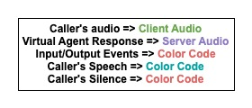
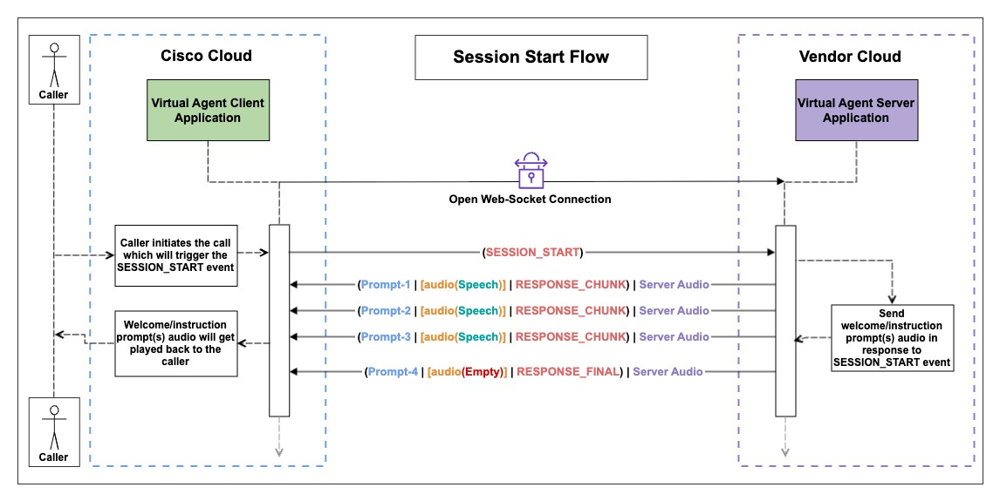
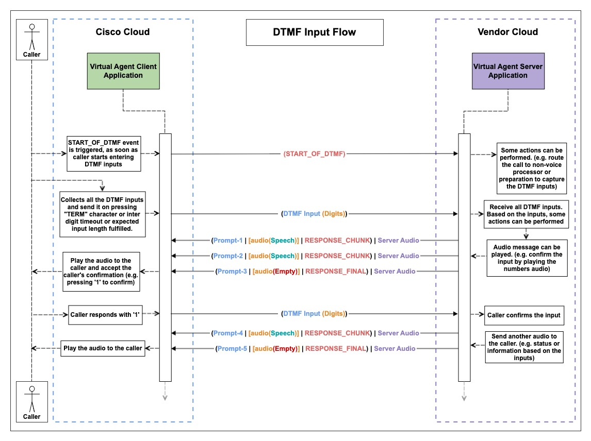
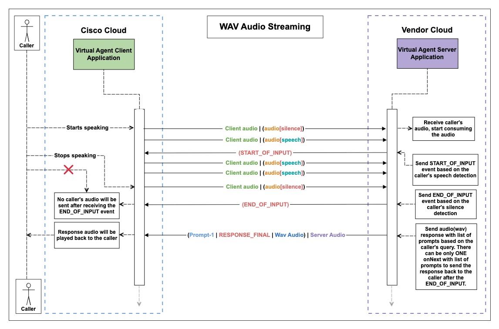
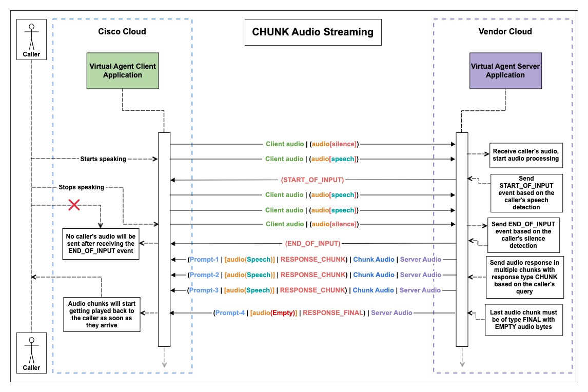
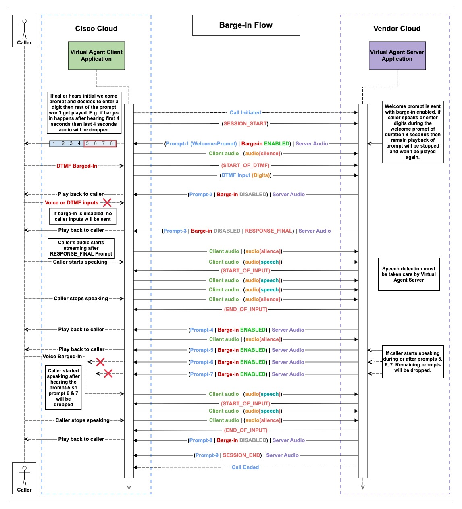
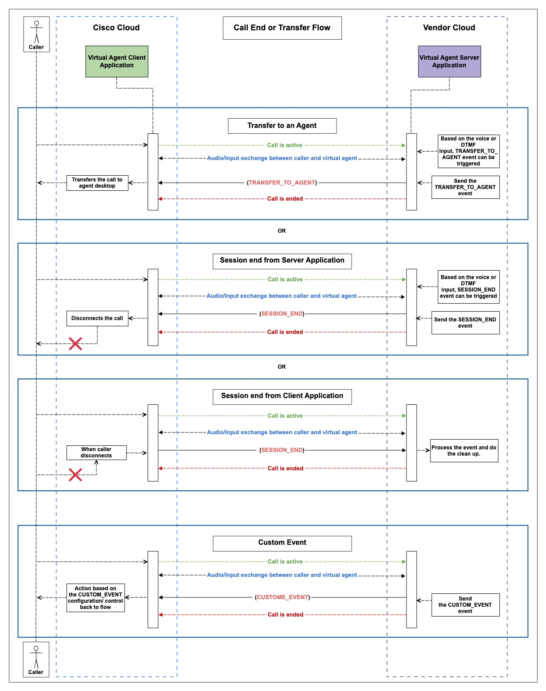

# Bring Your Own Virtual Agent — WebSocket

The Bring-Your-Own-Virtual-Agent (BYoVA) initiative empowers developers and AI vendors to seamlessly integrate external conversational interfaces with Webex Contact Center (WxCC). The **WebSocket** flavour of the integration carries the entire conversation over **one long-lived WebSocket session per call**. The two sides exchange discrete request/response messages on the same socket — every event, every prompt, and every audio packet flows over the same connection until the call ends.

This document describes:

- The reference WebSocket simulator available under this directory — **JSON** wire format, Spring Boot / Java.
- The WebSocket framing rules every BYoVA server must follow (text frames, ping/pong, close codes, envelope ordering) and the high-level event/streaming contract the VA Server must honour.
- Detailed call-flow walkthroughs (with sequence diagrams) for session start, DTMF, audio (WAV and CHUNK), barge-in, and call-termination scenarios.

> **Canonical wire-format schema.** Every JSON envelope, payload, enum, and field referenced in this document is defined by the [Webex BYoVA WebSocket AsyncAPI schema][ws-schema] (`VoiceVirtualAgent_WsSchema.json`) on `github.com/webex/dataSourceSchemas`. Inline references like [`VOICE_VA_REQUEST`](https://github.com/webex/dataSourceSchemas/blob/main/Services/VoiceVirtualAgent_WebSocket/a38a10b7-43e4-4676-a076-a7d6dce9387d/AsyncApiSpec/VoiceVirtualAgent_WsSchema.json#L72) or [`SESSION_START`](https://github.com/webex/dataSourceSchemas/blob/main/Services/VoiceVirtualAgent_WebSocket/a38a10b7-43e4-4676-a076-a7d6dce9387d/AsyncApiSpec/VoiceVirtualAgent_WsSchema.json#L705) all link back to that single file — search inside it for the named schema component or enum value to find the precise definition. The schema is the source of truth; anywhere this document and the schema disagree, the schema wins.

---

## Table of Contents

- [WebSocket Virtual Agent Simulator](#websocket-virtual-agent-simulator)
- [WebSocket Framing & Streaming Guidelines](#websocket-framing--streaming-guidelines)
- [Virtual Agent Streaming and Event Handling Guidelines](#virtual-agent-streaming-and-event-handling-guidelines)
- [Detailed Flow with Sequence Diagrams](#detailed-flow-with-sequence-diagrams)
    - [Step 1. Start of Conversation](#step-1-start-of-conversation)
    - [Step 2. DTMF Input Flow](#step-2-dtmf-input-flow)
    - [Step 3. Audio Input Flow](#step-3-audio-input-flow)
        - [Step 3.1. WAV Audio Streaming](#step-31-wav-audio-streaming)
        - [Step 3.2. CHUNK Audio Streaming](#step-32-chunk-audio-streaming)
    - [Step 4. Barge-In Prompts](#step-4-barge-in-prompts)
    - [Step 5. Call Termination, Transfer, and Custom Event](#step-5-call-termination-transfer-and-custom-event)

---

## WebSocket Virtual Agent Simulator

This directory ships a Java reference simulator that uses the **JSON** wire format. It exposes the two endpoints WxCC connects to — `/v1/va` for the per-call channel and `/v1/listVirtualAgents` for VA discovery — and implements the full conceptual contract described below.

| Module | Stack | Get started |
|---|---|---|
| [`json-schema/simulators/byova-websocket-json-java/`](./json-schema/simulators/byova-websocket-json-java/) | Spring Boot 4 / Java 21, `spring-boot-starter-websocket`, Jackson, Maven | `mvn spring-boot:run` on port `8086`. See the [module README](./json-schema/simulators/byova-websocket-json-java/README.md) for prerequisites, configuration, JWS validation, Docker, and extension points. |

Folder layout at a glance:

```
web-socket-interface/
├── README.md                                ← this file (framing, flows, diagrams)
├── resources/
│   └── diagrams/                            ← WebSocket sequence diagrams (ws-*.jpeg)
└── json-schema/
    └── simulators/
        └── byova-websocket-json-java/       ← Spring Boot 4 + JSON; shipped
```

> The flow walkthroughs below use the message names defined by the [WebSocket AsyncAPI schema][ws-schema] (`VOICE_VA_REQUEST`, `VOICE_VA_RESPONSE`, etc.). The simulator implements those names verbatim, so you can cross-reference either the schema or the simulator's Java DTOs while reading.

## WebSocket Framing & Streaming Guidelines

These rules are framing-level — they apply to every WebSocket BYoVA server. The Java simulator implements them in [`VirtualAgentWebSocketHandler`](./json-schema/simulators/byova-websocket-json-java/src/main/java/com/cisco/wccai/handler/VirtualAgentWebSocketHandler.java).

1. **One WebSocket session per call.** WxCC opens a single WebSocket to `/v1/va` when the caller's call connects, and uses it for the entire conversation. There is **no** per-interaction handshake — every event, every prompt, and every audio packet flows over the same socket until it is closed.
2. **Text frames only.** All envelopes (control messages and caller audio) ride on **WebSocket text frames** carrying a JSON object. The caller's audio is base64-encoded inside the [`VoiceInput.caller_audio_b64`](https://github.com/webex/dataSourceSchemas/blob/main/Services/VoiceVirtualAgent_WebSocket/a38a10b7-43e4-4676-a076-a7d6dce9387d/AsyncApiSpec/VoiceVirtualAgent_WsSchema.json#L450) field — binary frames are not used.
3. **Envelope ordering.** Every envelope carries a monotonically increasing `seq` and a [`conversation_id`](https://github.com/webex/dataSourceSchemas/blob/main/Services/VoiceVirtualAgent_WebSocket/a38a10b7-43e4-4676-a076-a7d6dce9387d/AsyncApiSpec/VoiceVirtualAgent_WsSchema.json#L328) (see the [`WsEnvelopeBase`][ws-schema] schema). The VA Server must process incoming envelopes in `seq` order and stamp its own `seq` on outgoing ones; out-of-order delivery should be treated as a transport bug.
4. **Message types.** The wire-level discriminator is the envelope's `type` field — see the `type` enum on [`WsEnvelopeBase`][ws-schema]: [`VOICE_VA_REQUEST`](https://github.com/webex/dataSourceSchemas/blob/main/Services/VoiceVirtualAgent_WebSocket/a38a10b7-43e4-4676-a076-a7d6dce9387d/AsyncApiSpec/VoiceVirtualAgent_WsSchema.json#L72), [`VOICE_VA_RESPONSE`, `ERROR`, `PING`, `PONG`](https://github.com/webex/dataSourceSchemas/blob/main/Services/VoiceVirtualAgent_WebSocket/a38a10b7-43e4-4676-a076-a7d6dce9387d/AsyncApiSpec/VoiceVirtualAgent_WsSchema.json#L207). Anything else must be ignored with a logged warning.
5. **Ping / Pong.** WxCC sends `PING` envelopes (or WebSocket-level pings) periodically as a liveness probe. The VA Server must respond with `PONG` (or a WebSocket-level pong) — the simulator handles this in [`handlePongMessage`](./json-schema/simulators/byova-websocket-json-java/src/main/java/com/cisco/wccai/handler/VirtualAgentWebSocketHandler.java#L62). Failing to answer pings will trigger an idle close.
6. **Close codes.** Either side may initiate the close. The VA Server should close with `CloseStatus.NORMAL` after a [`SESSION_END`](https://github.com/webex/dataSourceSchemas/blob/main/Services/VoiceVirtualAgent_WebSocket/a38a10b7-43e4-4676-a076-a7d6dce9387d/AsyncApiSpec/VoiceVirtualAgent_WsSchema.json#L550); transport errors should close with `CloseStatus.SERVER_ERROR` (the simulator does this in [`handleTransportError`](./json-schema/simulators/byova-websocket-json-java/src/main/java/com/cisco/wccai/handler/VirtualAgentWebSocketHandler.java#L70)). After close, no further envelopes are accepted; a new call requires a new WebSocket.
7. **Discovery channel.** The separate `/v1/listVirtualAgents` endpoint is a short-lived request/response WebSocket — see [`ListVirtualAgentWebSocketHandler`](./json-schema/simulators/byova-websocket-json-java/src/main/java/com/cisco/wccai/handler/ListVirtualAgentWebSocketHandler.java). The client sends a single text frame containing a [`ListVARequest`](https://github.com/webex/dataSourceSchemas/blob/main/Services/VoiceVirtualAgent_WebSocket/a38a10b7-43e4-4676-a076-a7d6dce9387d/AsyncApiSpec/VoiceVirtualAgent_WsListVASchema.json#L53) JSON object (note: not enveloped — there is no `type` discriminator wrapper here); the server replies with a [`ListVAResponse`](https://github.com/webex/dataSourceSchemas/blob/main/Services/VoiceVirtualAgent_WebSocket/a38a10b7-43e4-4676-a076-a7d6dce9387d/AsyncApiSpec/VoiceVirtualAgent_WsListVASchema.json#L69) listing the available virtual agents, then either side closes. This channel is unrelated to the per-call `/v1/va` lifecycle. The discovery payloads are not yet covered by the public [WebSocket AsyncAPI schema][ws-schema] — see the simulator's [`ListVARequest`](./json-schema/simulators/byova-websocket-json-java/src/main/java/com/cisco/wccai/ws/list/ListVARequest.java), [`ListVAResponse`](./json-schema/simulators/byova-websocket-json-java/src/main/java/com/cisco/wccai/ws/list/ListVAResponse.java), and [`VirtualAgentInfo`](./json-schema/simulators/byova-websocket-json-java/src/main/java/com/cisco/wccai/ws/list/VirtualAgentInfo.java) for the in-use shape.
8. **Error envelope.** Either side may send an envelope of type [`ERROR`](https://github.com/webex/dataSourceSchemas/blob/main/Services/VoiceVirtualAgent_WebSocket/a38a10b7-43e4-4676-a076-a7d6dce9387d/AsyncApiSpec/VoiceVirtualAgent_WsSchema.json#L207) to surface a recoverable problem to the peer. The schema's [`WsEnvelopeError`](https://github.com/webex/dataSourceSchemas/blob/main/Services/VoiceVirtualAgent_WebSocket/a38a10b7-43e4-4676-a076-a7d6dce9387d/AsyncApiSpec/VoiceVirtualAgent_WsSchema.json#L276) defines the payload — `code` (one of [`unauthorized`, `bad_request`, `unsupported_media`, `upstream_error`, `rate_limit`, `timeout`](https://github.com/webex/dataSourceSchemas/blob/main/Services/VoiceVirtualAgent_WebSocket/a38a10b7-43e4-4676-a076-a7d6dce9387d/AsyncApiSpec/VoiceVirtualAgent_WsSchema.json#L286)), an HTTP-style `status` integer, and a free-text `detail`. The receiver should log it and decide whether to continue or close based on severity. The simulator logs and continues; it does not propagate `ERROR` envelopes back as `VOICE_VA_RESPONSE`.
9. **No mid-call resumption.** WebSockets are not auto-resumed: if the socket drops for any reason, the call is over from the VA Server's perspective. Do not buffer state hoping for a reconnect on the same `conversation_id`; the VA Client opens a brand-new socket for every new call.

## Virtual Agent Streaming and Event Handling Guidelines

These rules describe the BYoVA event contract that the VA Server must honour throughout the WebSocket session.

1. The sequence of events must follow the same order as outlined in the sequence diagrams below.
2. The welcome prompt must be sent in response to the [`SESSION_START`](https://github.com/webex/dataSourceSchemas/blob/main/Services/VoiceVirtualAgent_WebSocket/a38a10b7-43e4-4676-a076-a7d6dce9387d/AsyncApiSpec/VoiceVirtualAgent_WsSchema.json#L705) input event (see the `EventInputType` enum in the schema).
3. Sending [`END_OF_INPUT`](https://github.com/webex/dataSourceSchemas/blob/main/Services/VoiceVirtualAgent_WebSocket/a38a10b7-43e4-4676-a076-a7d6dce9387d/AsyncApiSpec/VoiceVirtualAgent_WsSchema.json#L554) (see the `OutputEventType` enum in the schema) immediately stops the caller's audio streaming, so it should be sent only on silence detection from the caller. (This is **not** true if [`Prompt.is_barge_in_enabled`][ws-schema] is `true` — see Step 4.)
4. If the caller does not provide any input within the configured timeout, the [`NO_INPUT`][ws-schema] event will be triggered.
5. Switching between Voice and DTMF is achieved by setting the desired [`VoiceVAResponse.input_mode`][ws-schema] field. There are three input modes (see the [`VoiceVAInputMode`](https://github.com/webex/dataSourceSchemas/blob/main/Services/VoiceVirtualAgent_WebSocket/a38a10b7-43e4-4676-a076-a7d6dce9387d/AsyncApiSpec/VoiceVirtualAgent_WsSchema.json#L636) enum):
    - [`INPUT_VOICE`](https://github.com/webex/dataSourceSchemas/blob/main/Services/VoiceVirtualAgent_WebSocket/a38a10b7-43e4-4676-a076-a7d6dce9387d/AsyncApiSpec/VoiceVirtualAgent_WsSchema.json#L636) — only voice input is accepted.
    - [`INPUT_EVENT_DTMF`](https://github.com/webex/dataSourceSchemas/blob/main/Services/VoiceVirtualAgent_WebSocket/a38a10b7-43e4-4676-a076-a7d6dce9387d/AsyncApiSpec/VoiceVirtualAgent_WsSchema.json#L641) — only DTMF input is accepted.
    - [`INPUT_VOICE_DTMF`](https://github.com/webex/dataSourceSchemas/blob/main/Services/VoiceVirtualAgent_WebSocket/a38a10b7-43e4-4676-a076-a7d6dce9387d/AsyncApiSpec/VoiceVirtualAgent_WsSchema.json#L642) — both voice and DTMF inputs are accepted.

   If `input_mode` is not specified, [`INPUT_VOICE_DTMF`](https://github.com/webex/dataSourceSchemas/blob/main/Services/VoiceVirtualAgent_WebSocket/a38a10b7-43e4-4676-a076-a7d6dce9387d/AsyncApiSpec/VoiceVirtualAgent_WsSchema.json#L642) is used as the default.


## Detailed Flow with Sequence Diagrams

The diagrams below use a colour-coded convention to keep the swim-lanes readable: caller audio (green) flows from the caller into the VA Server, server audio (blue) flows the other way, input/output events (red) drive state changes on either side, and per-utterance speech vs. silence segments use distinct colours so you can spot when the VA Server is detecting voice activity. The legend below shows each colour and its meaning — match it against the swim-lane labels in every diagram that follows.



### Step 1. Start of Conversation

1. The reference simulator starts up as a WebSocket Virtual Agent Server (**VA Server**) and listens on `/v1/va`.
2. When the caller's call is connected, the VA Client opens a WebSocket to the VA Server. The handshake carries the JWS in the `Authorization` header — the simulator's [`AuthorizationHandshakeInterceptor`](./json-schema/simulators/byova-websocket-json-java/src/main/java/com/cisco/wccai/auth/AuthorizationHandshakeInterceptor.java) validates it before opening the session.
3. Immediately after the upgrade succeeds, the VA Client sends its first envelope — a [`VOICE_VA_REQUEST`](https://github.com/webex/dataSourceSchemas/blob/main/Services/VoiceVirtualAgent_WebSocket/a38a10b7-43e4-4676-a076-a7d6dce9387d/AsyncApiSpec/VoiceVirtualAgent_WsSchema.json#L72) whose payload is a [`VoiceVARequest`](https://github.com/webex/dataSourceSchemas/blob/main/Services/VoiceVirtualAgent_WebSocket/a38a10b7-43e4-4676-a076-a7d6dce9387d/AsyncApiSpec/VoiceVirtualAgent_WsSchema.json#L324) carrying the [`SESSION_START`](https://github.com/webex/dataSourceSchemas/blob/main/Services/VoiceVirtualAgent_WebSocket/a38a10b7-43e4-4676-a076-a7d6dce9387d/AsyncApiSpec/VoiceVirtualAgent_WsSchema.json#L705) event. The `conversation_id` (defined on [`WsEnvelopeBase`][ws-schema]) is reused for the entire conversation. This first request is sent without any audio data.
4. [`SESSION_START`](https://github.com/webex/dataSourceSchemas/blob/main/Services/VoiceVirtualAgent_WebSocket/a38a10b7-43e4-4676-a076-a7d6dce9387d/AsyncApiSpec/VoiceVirtualAgent_WsSchema.json#L705) can be used by the VA Server to start a session with its AI service and reply with a [`VOICE_VA_RESPONSE`](https://github.com/webex/dataSourceSchemas/blob/main/Services/VoiceVirtualAgent_WebSocket/a38a10b7-43e4-4676-a076-a7d6dce9387d/AsyncApiSpec/VoiceVirtualAgent_WsSchema.json#L209) envelope wrapping a [`VoiceVAResponse`][ws-schema]. The response can include payloads, prompts, NLU data, and the [`input_mode`](https://github.com/webex/dataSourceSchemas/blob/main/Services/VoiceVirtualAgent_WebSocket/a38a10b7-43e4-4676-a076-a7d6dce9387d/AsyncApiSpec/VoiceVirtualAgent_WsSchema.json#L390) for the next interaction. Prompts contain the audio that will be played to the caller; one or more prompts can be returned in a single response and are played at the client side in the order received.
5. The WebSocket session stays open. The VA Client will continue to drive the conversation by sending further [`VOICE_VA_REQUEST`](https://github.com/webex/dataSourceSchemas/blob/main/Services/VoiceVirtualAgent_WebSocket/a38a10b7-43e4-4676-a076-a7d6dce9387d/AsyncApiSpec/VoiceVirtualAgent_WsSchema.json#L72) envelopes (audio, DTMF, events) on the **same** session.



### Step 2. DTMF Input Flow

1. When the caller enters DTMF input by pressing keys on the phone keypad, the VA Client sends a [`VOICE_VA_REQUEST`](https://github.com/webex/dataSourceSchemas/blob/main/Services/VoiceVirtualAgent_WebSocket/a38a10b7-43e4-4676-a076-a7d6dce9387d/AsyncApiSpec/VoiceVirtualAgent_WsSchema.json#L72) envelope carrying the [`START_OF_DTMF`](https://github.com/webex/dataSourceSchemas/blob/main/Services/VoiceVirtualAgent_WebSocket/a38a10b7-43e4-4676-a076-a7d6dce9387d/AsyncApiSpec/VoiceVirtualAgent_WsSchema.json#L708) event.
2. The [`START_OF_DTMF`](https://github.com/webex/dataSourceSchemas/blob/main/Services/VoiceVirtualAgent_WebSocket/a38a10b7-43e4-4676-a076-a7d6dce9387d/AsyncApiSpec/VoiceVirtualAgent_WsSchema.json#L708) event signals that the caller has begun entering DTMF inputs. Based on this event, specific actions can be taken on the server side, such as preparing expected-value matching, updating UI flags, or pausing prompt generation.
3. No [`VOICE_VA_RESPONSE`](https://github.com/webex/dataSourceSchemas/blob/main/Services/VoiceVirtualAgent_WebSocket/a38a10b7-43e4-4676-a076-a7d6dce9387d/AsyncApiSpec/VoiceVirtualAgent_WsSchema.json#L209) is required for [`START_OF_DTMF`](https://github.com/webex/dataSourceSchemas/blob/main/Services/VoiceVirtualAgent_WebSocket/a38a10b7-43e4-4676-a076-a7d6dce9387d/AsyncApiSpec/VoiceVirtualAgent_WsSchema.json#L708) itself — the VA Server simply acknowledges by continuing to listen on the socket.
4. Once the caller has finished entering DTMF input, the VA Client sends a follow-up [`VOICE_VA_REQUEST`](https://github.com/webex/dataSourceSchemas/blob/main/Services/VoiceVirtualAgent_WebSocket/a38a10b7-43e4-4676-a076-a7d6dce9387d/AsyncApiSpec/VoiceVirtualAgent_WsSchema.json#L72) carrying a [`DTMFInputs`](https://github.com/webex/dataSourceSchemas/blob/main/Services/VoiceVirtualAgent_WebSocket/a38a10b7-43e4-4676-a076-a7d6dce9387d/AsyncApiSpec/VoiceVirtualAgent_WsSchema.json#L667) payload (a list of [`DTMFDigits`](https://github.com/webex/dataSourceSchemas/blob/main/Services/VoiceVirtualAgent_WebSocket/a38a10b7-43e4-4676-a076-a7d6dce9387d/AsyncApiSpec/VoiceVirtualAgent_WsSchema.json#L645) enum values). The terminating condition is one of:
    - The [`DTMFInputConfig.dtmf_input_length`](https://github.com/webex/dataSourceSchemas/blob/main/Services/VoiceVirtualAgent_WebSocket/a38a10b7-43e4-4676-a076-a7d6dce9387d/AsyncApiSpec/VoiceVirtualAgent_WsSchema.json#L581) requirement is satisfied (the expected number of digits has been entered).
    - The [`DTMFInputConfig.inter_digit_timeout_msec`](https://github.com/webex/dataSourceSchemas/blob/main/Services/VoiceVirtualAgent_WebSocket/a38a10b7-43e4-4676-a076-a7d6dce9387d/AsyncApiSpec/VoiceVirtualAgent_WsSchema.json#L575) elapses.
    - The [`DTMFInputConfig.termchar`](https://github.com/webex/dataSourceSchemas/blob/main/Services/VoiceVirtualAgent_WebSocket/a38a10b7-43e4-4676-a076-a7d6dce9387d/AsyncApiSpec/VoiceVirtualAgent_WsSchema.json#L578) is pressed (default `DTMF_DIGIT_POUND` = `#` — see the [`DTMFDigits`](https://github.com/webex/dataSourceSchemas/blob/main/Services/VoiceVirtualAgent_WebSocket/a38a10b7-43e4-4676-a076-a7d6dce9387d/AsyncApiSpec/VoiceVirtualAgent_WsSchema.json#L645) enum for all valid values).
5. The received DTMF inputs can be processed according to the use case. For example, the VA Server can send back a [`VOICE_VA_RESPONSE`](https://github.com/webex/dataSourceSchemas/blob/main/Services/VoiceVirtualAgent_WebSocket/a38a10b7-43e4-4676-a076-a7d6dce9387d/AsyncApiSpec/VoiceVirtualAgent_WsSchema.json#L209) containing an audio prompt asking the caller to confirm the entry by pressing `1`.
6. The caller confirms the previously entered DTMF input by pressing `1`, which arrives as another [`VOICE_VA_REQUEST`](https://github.com/webex/dataSourceSchemas/blob/main/Services/VoiceVirtualAgent_WebSocket/a38a10b7-43e4-4676-a076-a7d6dce9387d/AsyncApiSpec/VoiceVirtualAgent_WsSchema.json#L72) carrying that single digit.
7. Another prompt (e.g. status or information based on the DTMF inputs) can be sent in response as another [`VOICE_VA_RESPONSE`](https://github.com/webex/dataSourceSchemas/blob/main/Services/VoiceVirtualAgent_WebSocket/a38a10b7-43e4-4676-a076-a7d6dce9387d/AsyncApiSpec/VoiceVirtualAgent_WsSchema.json#L209).



### Step 3. Audio Input Flow

At the start of the call, the VA Server must choose between **WAV Streaming** and **CHUNK Streaming**; this decision must not change during the call. For scripted virtual agents where prompts are pre-configured the VA Server should use WAV streaming; for longer prompts produced by LLMs it should use CHUNK streaming. The simulator's mode is controlled by `voice.va.audio.use-chunked-audio` in [`application.properties`](./json-schema/simulators/byova-websocket-json-java/src/main/resources/application.properties).

The mode is signalled per-prompt via the [`VoiceVAResponse.response_type`][ws-schema] field (see the [`ResponseType`](https://github.com/webex/dataSourceSchemas/blob/main/Services/VoiceVirtualAgent_WebSocket/a38a10b7-43e4-4676-a076-a7d6dce9387d/AsyncApiSpec/VoiceVirtualAgent_WsSchema.json#L628) enum):

- **WAV Streaming** — always send the response as [`FINAL`](https://github.com/webex/dataSourceSchemas/blob/main/Services/VoiceVirtualAgent_WebSocket/a38a10b7-43e4-4676-a076-a7d6dce9387d/AsyncApiSpec/VoiceVirtualAgent_WsSchema.json#L631) in a single [`VOICE_VA_RESPONSE`](https://github.com/webex/dataSourceSchemas/blob/main/Services/VoiceVirtualAgent_WebSocket/a38a10b7-43e4-4676-a076-a7d6dce9387d/AsyncApiSpec/VoiceVirtualAgent_WsSchema.json#L209) envelope, with the WAV header included in the audio bytes.
- **CHUNK Streaming** — send the audio across multiple [`VOICE_VA_RESPONSE`](https://github.com/webex/dataSourceSchemas/blob/main/Services/VoiceVirtualAgent_WebSocket/a38a10b7-43e4-4676-a076-a7d6dce9387d/AsyncApiSpec/VoiceVirtualAgent_WsSchema.json#L209) envelopes of type [`CHUNK`](https://github.com/webex/dataSourceSchemas/blob/main/Services/VoiceVirtualAgent_WebSocket/a38a10b7-43e4-4676-a076-a7d6dce9387d/AsyncApiSpec/VoiceVirtualAgent_WsSchema.json#L633), and terminate the prompt with a final [`VOICE_VA_RESPONSE`](https://github.com/webex/dataSourceSchemas/blob/main/Services/VoiceVirtualAgent_WebSocket/a38a10b7-43e4-4676-a076-a7d6dce9387d/AsyncApiSpec/VoiceVirtualAgent_WsSchema.json#L209) of type [`FINAL`](https://github.com/webex/dataSourceSchemas/blob/main/Services/VoiceVirtualAgent_WebSocket/a38a10b7-43e4-4676-a076-a7d6dce9387d/AsyncApiSpec/VoiceVirtualAgent_WsSchema.json#L631) carrying **empty** audio bytes. The minimum [`CHUNK`](https://github.com/webex/dataSourceSchemas/blob/main/Services/VoiceVirtualAgent_WebSocket/a38a10b7-43e4-4676-a076-a7d6dce9387d/AsyncApiSpec/VoiceVirtualAgent_WsSchema.json#L633) size is 100 bytes and the maximum is 64 KB (65,536 bytes); keep chunks as large as possible up to that limit.

#### Step 3.1. WAV Audio Streaming

1. When the caller starts speaking, the VA Client sends [`VOICE_VA_REQUEST`](https://github.com/webex/dataSourceSchemas/blob/main/Services/VoiceVirtualAgent_WebSocket/a38a10b7-43e4-4676-a076-a7d6dce9387d/AsyncApiSpec/VoiceVirtualAgent_WsSchema.json#L72) envelopes carrying caller audio over the open WebSocket session.
2. The VA Server must be capable of detecting both speech and silence in the caller's audio (the simulator's [`SpeechDetectionService`](./json-schema/simulators/byova-websocket-json-java/src/main/java/com/cisco/wccai/service/SpeechDetectionService.java) shows one approach using an amplitude threshold).
3. Once speech is detected, send a [`VOICE_VA_RESPONSE`](https://github.com/webex/dataSourceSchemas/blob/main/Services/VoiceVirtualAgent_WebSocket/a38a10b7-43e4-4676-a076-a7d6dce9387d/AsyncApiSpec/VoiceVirtualAgent_WsSchema.json#L209) containing the [`START_OF_INPUT`](https://github.com/webex/dataSourceSchemas/blob/main/Services/VoiceVirtualAgent_WebSocket/a38a10b7-43e4-4676-a076-a7d6dce9387d/AsyncApiSpec/VoiceVirtualAgent_WsSchema.json#L553) output event.
4. Continue consuming caller audio envelopes until silence is detected.
5. Once silence is detected, send a [`VOICE_VA_RESPONSE`](https://github.com/webex/dataSourceSchemas/blob/main/Services/VoiceVirtualAgent_WebSocket/a38a10b7-43e4-4676-a076-a7d6dce9387d/AsyncApiSpec/VoiceVirtualAgent_WsSchema.json#L209) containing the [`END_OF_INPUT`](https://github.com/webex/dataSourceSchemas/blob/main/Services/VoiceVirtualAgent_WebSocket/a38a10b7-43e4-4676-a076-a7d6dce9387d/AsyncApiSpec/VoiceVirtualAgent_WsSchema.json#L554) output event. (Sending [`END_OF_INPUT`](https://github.com/webex/dataSourceSchemas/blob/main/Services/VoiceVirtualAgent_WebSocket/a38a10b7-43e4-4676-a076-a7d6dce9387d/AsyncApiSpec/VoiceVirtualAgent_WsSchema.json#L554) immediately stops the caller's audio stream from the VA Client.)
6. The VA Server must wait for response generation to complete so that all responses can be sent in a single [`VOICE_VA_RESPONSE`](https://github.com/webex/dataSourceSchemas/blob/main/Services/VoiceVirtualAgent_WebSocket/a38a10b7-43e4-4676-a076-a7d6dce9387d/AsyncApiSpec/VoiceVirtualAgent_WsSchema.json#L209) envelope. (The audio must include a WAV header for each [`FINAL`](https://github.com/webex/dataSourceSchemas/blob/main/Services/VoiceVirtualAgent_WebSocket/a38a10b7-43e4-4676-a076-a7d6dce9387d/AsyncApiSpec/VoiceVirtualAgent_WsSchema.json#L631) envelope.)
7. Send all responses, either as one prompt or a list of prompts, with response type [`FINAL`](https://github.com/webex/dataSourceSchemas/blob/main/Services/VoiceVirtualAgent_WebSocket/a38a10b7-43e4-4676-a076-a7d6dce9387d/AsyncApiSpec/VoiceVirtualAgent_WsSchema.json#L631) in a single envelope. (More than one envelope is not permitted for [`FINAL`](https://github.com/webex/dataSourceSchemas/blob/main/Services/VoiceVirtualAgent_WebSocket/a38a10b7-43e4-4676-a076-a7d6dce9387d/AsyncApiSpec/VoiceVirtualAgent_WsSchema.json#L631) responses in WAV mode.)



#### Step 3.2. CHUNK Audio Streaming

1. When the caller starts speaking, the VA Client sends [`VOICE_VA_REQUEST`](https://github.com/webex/dataSourceSchemas/blob/main/Services/VoiceVirtualAgent_WebSocket/a38a10b7-43e4-4676-a076-a7d6dce9387d/AsyncApiSpec/VoiceVirtualAgent_WsSchema.json#L72) envelopes carrying caller audio over the open WebSocket session.
2. The VA Server must be capable of detecting both speech and silence in the caller's audio.
3. Once speech is detected, send a [`VOICE_VA_RESPONSE`](https://github.com/webex/dataSourceSchemas/blob/main/Services/VoiceVirtualAgent_WebSocket/a38a10b7-43e4-4676-a076-a7d6dce9387d/AsyncApiSpec/VoiceVirtualAgent_WsSchema.json#L209) containing the [`START_OF_INPUT`](https://github.com/webex/dataSourceSchemas/blob/main/Services/VoiceVirtualAgent_WebSocket/a38a10b7-43e4-4676-a076-a7d6dce9387d/AsyncApiSpec/VoiceVirtualAgent_WsSchema.json#L553) output event.
4. Continue consuming caller audio envelopes until silence is detected.
5. Once silence is detected, send a [`VOICE_VA_RESPONSE`](https://github.com/webex/dataSourceSchemas/blob/main/Services/VoiceVirtualAgent_WebSocket/a38a10b7-43e4-4676-a076-a7d6dce9387d/AsyncApiSpec/VoiceVirtualAgent_WsSchema.json#L209) containing the [`END_OF_INPUT`](https://github.com/webex/dataSourceSchemas/blob/main/Services/VoiceVirtualAgent_WebSocket/a38a10b7-43e4-4676-a076-a7d6dce9387d/AsyncApiSpec/VoiceVirtualAgent_WsSchema.json#L554) output event. (Sending [`END_OF_INPUT`](https://github.com/webex/dataSourceSchemas/blob/main/Services/VoiceVirtualAgent_WebSocket/a38a10b7-43e4-4676-a076-a7d6dce9387d/AsyncApiSpec/VoiceVirtualAgent_WsSchema.json#L554) immediately stops the caller's audio stream from the VA Client.)
6. The VA Server does not need to wait for response generation to finish. Audio responses can be sent in multiple [`VOICE_VA_RESPONSE`](https://github.com/webex/dataSourceSchemas/blob/main/Services/VoiceVirtualAgent_WebSocket/a38a10b7-43e4-4676-a076-a7d6dce9387d/AsyncApiSpec/VoiceVirtualAgent_WsSchema.json#L209) envelopes with response type [`CHUNK`](https://github.com/webex/dataSourceSchemas/blob/main/Services/VoiceVirtualAgent_WebSocket/a38a10b7-43e4-4676-a076-a7d6dce9387d/AsyncApiSpec/VoiceVirtualAgent_WsSchema.json#L633), without WAV headers, as soon as they are ready.
7. The last [`VOICE_VA_RESPONSE`](https://github.com/webex/dataSourceSchemas/blob/main/Services/VoiceVirtualAgent_WebSocket/a38a10b7-43e4-4676-a076-a7d6dce9387d/AsyncApiSpec/VoiceVirtualAgent_WsSchema.json#L209) for this prompt must contain empty audio bytes and response type [`FINAL`](https://github.com/webex/dataSourceSchemas/blob/main/Services/VoiceVirtualAgent_WebSocket/a38a10b7-43e4-4676-a076-a7d6dce9387d/AsyncApiSpec/VoiceVirtualAgent_WsSchema.json#L631) — this signals "end of prompt" to the VA Client.



### Step 4. Barge-In Prompts

Every prompt has an [`is_barge_in_enabled`](https://github.com/webex/dataSourceSchemas/blob/main/Services/VoiceVirtualAgent_WebSocket/a38a10b7-43e4-4676-a076-a7d6dce9387d/AsyncApiSpec/VoiceVirtualAgent_WsSchema.json#L509) flag (`true`/`false`) on [`Prompt`](https://github.com/webex/dataSourceSchemas/blob/main/Services/VoiceVirtualAgent_WebSocket/a38a10b7-43e4-4676-a076-a7d6dce9387d/AsyncApiSpec/VoiceVirtualAgent_WsSchema.json#L495). When barge-in is enabled, any prompt — regardless of its [`response_type`][ws-schema] ([`CHUNK`](https://github.com/webex/dataSourceSchemas/blob/main/Services/VoiceVirtualAgent_WebSocket/a38a10b7-43e4-4676-a076-a7d6dce9387d/AsyncApiSpec/VoiceVirtualAgent_WsSchema.json#L633), [`FINAL`](https://github.com/webex/dataSourceSchemas/blob/main/Services/VoiceVirtualAgent_WebSocket/a38a10b7-43e4-4676-a076-a7d6dce9387d/AsyncApiSpec/VoiceVirtualAgent_WsSchema.json#L631), [`PARTIAL`](https://github.com/webex/dataSourceSchemas/blob/main/Services/VoiceVirtualAgent_WebSocket/a38a10b7-43e4-4676-a076-a7d6dce9387d/AsyncApiSpec/VoiceVirtualAgent_WsSchema.json#L630)) or [`input_mode`](https://github.com/webex/dataSourceSchemas/blob/main/Services/VoiceVirtualAgent_WebSocket/a38a10b7-43e4-4676-a076-a7d6dce9387d/AsyncApiSpec/VoiceVirtualAgent_WsSchema.json#L390) (see [`VoiceVAInputMode`](https://github.com/webex/dataSourceSchemas/blob/main/Services/VoiceVirtualAgent_WebSocket/a38a10b7-43e4-4676-a076-a7d6dce9387d/AsyncApiSpec/VoiceVirtualAgent_WsSchema.json#L636)) — can be barged in by caller input, except prompts associated with a termination or transfer event. The sequence diagram below uses the [`INPUT_VOICE_DTMF`](https://github.com/webex/dataSourceSchemas/blob/main/Services/VoiceVirtualAgent_WebSocket/a38a10b7-43e4-4676-a076-a7d6dce9387d/AsyncApiSpec/VoiceVirtualAgent_WsSchema.json#L642) input mode, meaning that the VA Client will continually send caller-audio envelopes (silent until the caller speaks); the same applies to [`INPUT_VOICE`](https://github.com/webex/dataSourceSchemas/blob/main/Services/VoiceVirtualAgent_WebSocket/a38a10b7-43e4-4676-a076-a7d6dce9387d/AsyncApiSpec/VoiceVirtualAgent_WsSchema.json#L640). For [`INPUT_EVENT_DTMF`](https://github.com/webex/dataSourceSchemas/blob/main/Services/VoiceVirtualAgent_WebSocket/a38a10b7-43e4-4676-a076-a7d6dce9387d/AsyncApiSpec/VoiceVirtualAgent_WsSchema.json#L641), envelopes are sent only when the caller submits DTMF input.

1. After [`SESSION_START`](https://github.com/webex/dataSourceSchemas/blob/main/Services/VoiceVirtualAgent_WebSocket/a38a10b7-43e4-4676-a076-a7d6dce9387d/AsyncApiSpec/VoiceVirtualAgent_WsSchema.json#L705), the VA Server sends an 8-second Welcome-Prompt with [`is_barge_in_enabled`](https://github.com/webex/dataSourceSchemas/blob/main/Services/VoiceVirtualAgent_WebSocket/a38a10b7-43e4-4676-a076-a7d6dce9387d/AsyncApiSpec/VoiceVirtualAgent_WsSchema.json#L509) = `true` in a single [`VOICE_VA_RESPONSE`](https://github.com/webex/dataSourceSchemas/blob/main/Services/VoiceVirtualAgent_WebSocket/a38a10b7-43e4-4676-a076-a7d6dce9387d/AsyncApiSpec/VoiceVirtualAgent_WsSchema.json#L209) envelope. The WebSocket session stays open.
2. The VA Client begins streaming silent caller-audio envelopes on the same session.
3. As soon as the caller enters DTMF input — say, after hearing 4 seconds of the prompt — it barges in on the Welcome-Prompt. The VA Client sends a [`VOICE_VA_REQUEST`](https://github.com/webex/dataSourceSchemas/blob/main/Services/VoiceVirtualAgent_WebSocket/a38a10b7-43e4-4676-a076-a7d6dce9387d/AsyncApiSpec/VoiceVirtualAgent_WsSchema.json#L72) carrying the [`START_OF_DTMF`](https://github.com/webex/dataSourceSchemas/blob/main/Services/VoiceVirtualAgent_WebSocket/a38a10b7-43e4-4676-a076-a7d6dce9387d/AsyncApiSpec/VoiceVirtualAgent_WsSchema.json#L708) event followed by a [`VOICE_VA_REQUEST`](https://github.com/webex/dataSourceSchemas/blob/main/Services/VoiceVirtualAgent_WebSocket/a38a10b7-43e4-4676-a076-a7d6dce9387d/AsyncApiSpec/VoiceVirtualAgent_WsSchema.json#L72) carrying the collected DTMF digits.
4. The VA Server processes the DTMF inputs and sends Prompt-1 and Prompt-2 with [`is_barge_in_enabled`](https://github.com/webex/dataSourceSchemas/blob/main/Services/VoiceVirtualAgent_WebSocket/a38a10b7-43e4-4676-a076-a7d6dce9387d/AsyncApiSpec/VoiceVirtualAgent_WsSchema.json#L509) = `false` in [`VOICE_VA_RESPONSE`](https://github.com/webex/dataSourceSchemas/blob/main/Services/VoiceVirtualAgent_WebSocket/a38a10b7-43e4-4676-a076-a7d6dce9387d/AsyncApiSpec/VoiceVirtualAgent_WsSchema.json#L209) envelopes.
5. Prompt-1 and Prompt-2 cannot be barged in and will be played in full even if the caller speaks or enters DTMF; any caller input at this point is dropped at the client side.
6. The VA Client resumes streaming caller audio. The VA Server detects speech and sends a [`START_OF_INPUT`](https://github.com/webex/dataSourceSchemas/blob/main/Services/VoiceVirtualAgent_WebSocket/a38a10b7-43e4-4676-a076-a7d6dce9387d/AsyncApiSpec/VoiceVirtualAgent_WsSchema.json#L553) [`VOICE_VA_RESPONSE`](https://github.com/webex/dataSourceSchemas/blob/main/Services/VoiceVirtualAgent_WebSocket/a38a10b7-43e4-4676-a076-a7d6dce9387d/AsyncApiSpec/VoiceVirtualAgent_WsSchema.json#L209).
7. The VA Server collects caller audio until silence is detected, then sends [`END_OF_INPUT`](https://github.com/webex/dataSourceSchemas/blob/main/Services/VoiceVirtualAgent_WebSocket/a38a10b7-43e4-4676-a076-a7d6dce9387d/AsyncApiSpec/VoiceVirtualAgent_WsSchema.json#L554).
8. The VA Server sends 4 prompts with [`is_barge_in_enabled`](https://github.com/webex/dataSourceSchemas/blob/main/Services/VoiceVirtualAgent_WebSocket/a38a10b7-43e4-4676-a076-a7d6dce9387d/AsyncApiSpec/VoiceVirtualAgent_WsSchema.json#L509) = `true`.
9. Prompt-3 and Prompt-4 are played to the caller; the caller then barges in, causing Prompt-5 and Prompt-6 to be dropped at the client side.
10. The VA Server detects the caller's speech and sends [`START_OF_INPUT`](https://github.com/webex/dataSourceSchemas/blob/main/Services/VoiceVirtualAgent_WebSocket/a38a10b7-43e4-4676-a076-a7d6dce9387d/AsyncApiSpec/VoiceVirtualAgent_WsSchema.json#L553) again, then collects audio until silence is detected.
11. On detecting silence, the VA Server sends [`END_OF_INPUT`](https://github.com/webex/dataSourceSchemas/blob/main/Services/VoiceVirtualAgent_WebSocket/a38a10b7-43e4-4676-a076-a7d6dce9387d/AsyncApiSpec/VoiceVirtualAgent_WsSchema.json#L554) and the final Prompt-7 (with [`is_barge_in_enabled`](https://github.com/webex/dataSourceSchemas/blob/main/Services/VoiceVirtualAgent_WebSocket/a38a10b7-43e4-4676-a076-a7d6dce9387d/AsyncApiSpec/VoiceVirtualAgent_WsSchema.json#L509) = `false`) is played to the caller.



### Step 5. Call Termination, Transfer, and Custom Event

A call can be terminated, transferred to a live agent, or used to drive a custom action (e.g. moving the caller to another queue). All three are signalled via the [`OutputEventType`](https://github.com/webex/dataSourceSchemas/blob/main/Services/VoiceVirtualAgent_WebSocket/a38a10b7-43e4-4676-a076-a7d6dce9387d/AsyncApiSpec/VoiceVirtualAgent_WsSchema.json#L546) / [`EventInputType`](https://github.com/webex/dataSourceSchemas/blob/main/Services/VoiceVirtualAgent_WebSocket/a38a10b7-43e4-4676-a076-a7d6dce9387d/AsyncApiSpec/VoiceVirtualAgent_WsSchema.json#L701) enums on the existing WebSocket session — there is no separate teardown channel.

1. **Transfer to agent** — an ongoing call with a virtual agent can be transferred to a live agent by sending the [`TRANSFER_TO_AGENT`][ws-schema] output event in a [`VOICE_VA_RESPONSE`](https://github.com/webex/dataSourceSchemas/blob/main/Services/VoiceVirtualAgent_WebSocket/a38a10b7-43e4-4676-a076-a7d6dce9387d/AsyncApiSpec/VoiceVirtualAgent_WsSchema.json#L209) envelope, optionally accompanied by an audio prompt. The VA Client will play the prompt, hand the call to a live agent, and close the WebSocket.
2. **Session end from server** — the VA Server can disconnect the call by sending the [`SESSION_END`](https://github.com/webex/dataSourceSchemas/blob/main/Services/VoiceVirtualAgent_WebSocket/a38a10b7-43e4-4676-a076-a7d6dce9387d/AsyncApiSpec/VoiceVirtualAgent_WsSchema.json#L550) output event in a [`VOICE_VA_RESPONSE`](https://github.com/webex/dataSourceSchemas/blob/main/Services/VoiceVirtualAgent_WebSocket/a38a10b7-43e4-4676-a076-a7d6dce9387d/AsyncApiSpec/VoiceVirtualAgent_WsSchema.json#L209) envelope, optionally accompanied by an audio prompt. After the prompt is played, the VA Client closes the WebSocket; the VA Server should reciprocate with `CloseStatus.NORMAL`.
3. **Session end from client** — when the caller hangs up, the VA Client sends a [`VOICE_VA_REQUEST`](https://github.com/webex/dataSourceSchemas/blob/main/Services/VoiceVirtualAgent_WebSocket/a38a10b7-43e4-4676-a076-a7d6dce9387d/AsyncApiSpec/VoiceVirtualAgent_WsSchema.json#L72) carrying the [`SESSION_END`](https://github.com/webex/dataSourceSchemas/blob/main/Services/VoiceVirtualAgent_WebSocket/a38a10b7-43e4-4676-a076-a7d6dce9387d/AsyncApiSpec/VoiceVirtualAgent_WsSchema.json#L706) input event and then closes the WebSocket. No prompt can be sent in response — the socket is gone by the time the VA Server reads the event.
4. **Custom event** — [`CUSTOM_EVENT`](https://github.com/webex/dataSourceSchemas/blob/main/Services/VoiceVirtualAgent_WebSocket/a38a10b7-43e4-4676-a076-a7d6dce9387d/AsyncApiSpec/VoiceVirtualAgent_WsSchema.json#L552) (output and input — the same identifier appears in both the [`OutputEventType`](https://github.com/webex/dataSourceSchemas/blob/main/Services/VoiceVirtualAgent_WebSocket/a38a10b7-43e4-4676-a076-a7d6dce9387d/AsyncApiSpec/VoiceVirtualAgent_WsSchema.json#L546) and [`EventInputType`](https://github.com/webex/dataSourceSchemas/blob/main/Services/VoiceVirtualAgent_WebSocket/a38a10b7-43e4-4676-a076-a7d6dce9387d/AsyncApiSpec/VoiceVirtualAgent_WsSchema.json#L701) enums) can be used to trigger pre-configured custom actions (queue moves, CRM screen-pops, analytics tagging, etc.) without ending the session.

The diagram below shows all four termination scenarios side by side — transfer to a live agent, server-initiated session end, client-initiated session end (caller hangs up), and a custom-event hand-off back to the flow — each followed by the WebSocket close.



---

> **Note:** These flow diagrams are illustrative and may not cover every possible scenario or edge case. The actual implementation may vary based on specific requirements, configurations, and the language / framework you choose. For any questions or clarifications regarding the call flow, please refer to the canonical [WebSocket AsyncAPI schema][ws-schema] or the simulator README ([`json-schema/simulators/byova-websocket-json-java/README.md`](./json-schema/simulators/byova-websocket-json-java/README.md)), or contact the support team.

[ws-schema]: https://github.com/webex/dataSourceSchemas/blob/main/Services/VoiceVirtualAgent_WebSocket/a38a10b7-43e4-4676-a076-a7d6dce9387d/AsyncApiSpec/VoiceVirtualAgent_WsSchema.json
