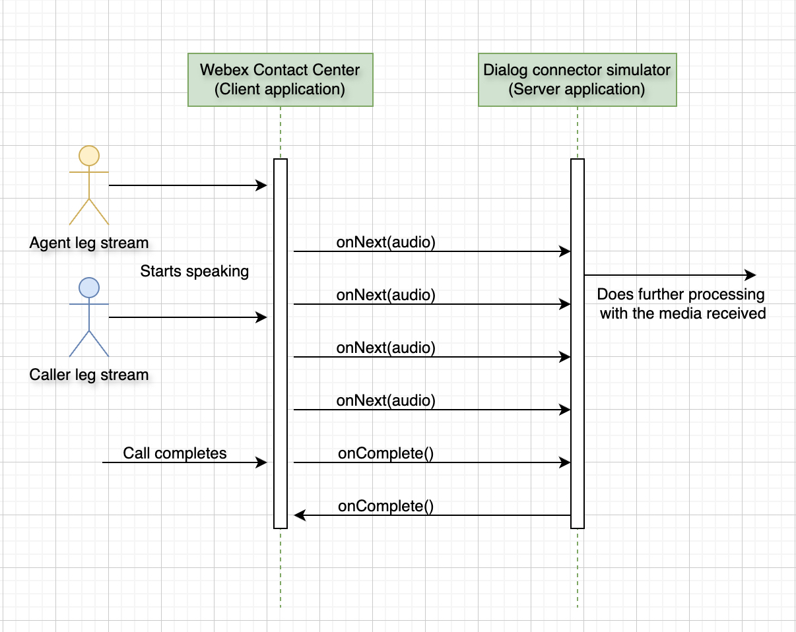

# Real-Time Media Forking

The **Real-Time Media Forking** feature of Webex Contact Center (WxCC) allows partners and customers to receive a live, real-time copy ("fork") of the audio of a human-agent ↔ caller interaction at a server they host. The forked audio is delivered over a gRPC bidirectional stream and can be plugged into any downstream consumer — call recording, post-call analytics, real-time fraud / sentiment detection, real-time transcription / agent assist, compliance monitoring, and so on.

This README focuses on the parts of the journey that are **specific to media forking** — what the feature does, the supported integration variants in this directory, the audio constraints every implementation must respect, the onboarding steps that wire your forking server into Webex, and the runtime authentication contract (JWS) that protects every call. The shared customer/partner onboarding flow (Service App, BYoDS, tokens) and the broader Media Service APIs context live in the [repo root README](../README.md) — this page links back to the relevant root sections rather than duplicating them.

## Table of Contents

- [What Is Real-Time Media Forking?](#what-is-real-time-media-forking)
- [Integration Variants in This Directory](#integration-variants-in-this-directory)
- [Audio & Runtime Constraints](#audio--runtime-constraints)
- [Onboarding a New Customer / Partner](#onboarding-a-new-customer--partner)
- [Runtime Authentication: JWS Validation](#runtime-authentication-jws-validation)
- [Operational Considerations](#operational-considerations)
- [Where to Go Next](#where-to-go-next)
- [References](#references)

---

## What Is Real-Time Media Forking?

Once an agent and a caller are connected on a Webex Contact Center call, WxCC opens a gRPC bidirectional stream to a forking server you host (registered with Webex as a data source) and streams both legs of the conversation to it in real time:

- WxCC acts as the **gRPC client**.
- Your service implements the **gRPC server** of the [`ConversationAudio`](#integration-variants-in-this-directory) service.
- For every audio frame it captures from either leg, WxCC sends one `ConversationAudioForkingRequest` containing the conversation id, customer org id, and an `AudioStream` (bytes + encoding + sample rate + capture timestamp + role + per-leg id).
- When the call ends, WxCC half-closes the stream; your server replies with a single `ConversationAudioForkingResponse` carrying `status_message="SUCCESS"` and closes too.

Two attributes on every frame are particularly important for downstream processing:

- **`audio.role`** — `CALLER` or `AGENT`. Use this to demultiplex the two legs into separate audio sinks / ASR sessions.
- **`audio.role_id`** — a per-leg GUID, useful when more than one party occupies a role (e.g. multi-party conferences or supervisor whisper).

The proto contract is shipped with this sample at [`simulators/media-forking-java/src/main/proto/com/cisco/wcc/ccai/media/v1/conversationaudioforking.proto`](./simulators/media-forking-java/src/main/proto/com/cisco/wcc/ccai/media/v1/conversationaudioforking.proto) (with shared types in [`common/media_service_common.proto`](./simulators/media-forking-java/src/main/proto/com/cisco/wcc/ccai/media/v1/common/media_service_common.proto)). Refer to the [Real-Time Media Forking section of the repo root README](../README.md#starting-media-forking-section) for the high-level feature overview.

The end-to-end interaction between WxCC and a forking server looks like this:



## Integration Variants in This Directory

All runnable reference implementations live under [`simulators/`](./simulators/) — one sub-folder per language. Each simulator is a self-contained, end-to-end forking server you can `git clone` and run as-is to validate your WxCC config without writing any code first; it then doubles as the starting point for your production fork-consumer.

Media forking only supports one transport (gRPC bidirectional streaming with protobuf), so the matrix below is one row per language. Pick the cell that matches your stack — both implement the same `ConversationAudio` service.

| Transport | Schema | Java simulator | Python simulator |
|---|---|---|---|
| **gRPC — bidirectional streaming** (single RPC carries the full call) | Protobuf | [`simulators/media-forking-java/`](./simulators/media-forking-java/) | [`simulators/media-forking-python/`](./simulators/media-forking-python/) *(scaffolded — implementation in progress)* |

Folder layout at a glance:

```
media-forking/
├── README.md                       ← this file (feature overview, onboarding, JWS)
├── images/                         ← diagrams referenced from this README
└── simulators/                     ← runnable reference implementations
    ├── media-forking-java/         ← Spring Boot + gRPC sample (shipped)
    └── media-forking-python/       ← scaffolded; implementation in progress
```

For per-simulator prerequisites, run instructions, configuration knobs, and the gRPC message-by-message contract, head to the README inside the simulator folder you choose (e.g. [`simulators/media-forking-java/README.md`](./simulators/media-forking-java/README.md)). The cell marked *scaffolded* contains a placeholder directory but no runtime code yet.

## Audio & Runtime Constraints

Independent of the language you pick, the WxCC client and any forking server must agree on these audio characteristics:

- **Audio format:** raw PCM frames (the gRPC payload carries the bytes; there is no WAV header per frame).
- **Sample rate:** 8 kHz or 16 kHz, populated in `AudioStream.sample_rate_hertz`.
- **Channels:** mono (single channel) per leg.
- **Encoding:** one of `LINEAR16`, `MULAW`, or `ALAW`, populated in `AudioStream.encoding`.
- **Frame cadence:** small frames are streamed as the audio is captured; do not assume a fixed frame size — buffer on the receiving side as needed.
- **Capture timestamp:** `AudioStream.audio_timestamp` is the wall-clock instant the audio was captured at the source; use it to compute end-to-end latency and to time-align the two legs.

The Java simulator uses these directly to log per-frame latency and per-(conversation, role) counters; see [`simulators/media-forking-java/src/main/java/com/cisco/wccai/forking/service/ConversationAudioProcessor.java`](./simulators/media-forking-java/src/main/java/com/cisco/wccai/forking/service/ConversationAudioProcessor.java).

---

## Onboarding a New Customer / Partner

The Webex side of media-forking onboarding shares **the same four-step flow** that every Media Service API uses (Service App → tokens → data source → config + flow). Rather than duplicate it here, the steps below highlight only what is specific to media forking; for the full step-by-step (with portal screenshots and `curl` examples), follow the links into the repo root README.

1. **Create and authorize a Service App** — *no media-forking-specific fields*. Follow the root README's [Customer / Partner onboarding section](../README.md#byova-onboarding-section). Make sure the **valid domains** you declare on the service app cover every FQDN your forking server will be reachable on.

2. **Generate Service-App tokens** — *no media-forking-specific fields*. Follow the same section in the root README; keep the access + refresh token pair safe.

3. **Register a Data Source for media forking** — same `POST /v1/dataSources` API as documented in the root README's [Register data source subsection](../README.md#byova-onboarding-section), but the request body must use the **media-forking schema id** (not the BYoVA one). Set:
    - `schemaId` → the **media-forking schema UUID** from the [WxCC schema catalog](https://github.com/webex/dataSourceSchemas) (your tenant docs / Control Hub will surface the exact value for your release).
    - `url` → the public HTTPS URL of your forking gRPC endpoint (must be inside one of the service-app valid domains).
    - `subject`, `audience`, `nonce`, `tokenLifeMinutes` → as per the root README example.

   Store the returned `jwsToken` securely — WxCC presents it as the bearer credential on every gRPC call, and your server validates it (see [Runtime Authentication](#runtime-authentication-jws-validation)).

4. **Create a config and flow that uses media forking** — go to [Control Hub → Integrations → Features](https://admin.webex.com/wxcc/integrations/features), create a new feature/config that selects your authorized service app and the forking data source. Then in the flow designer, add the **"Media Forking" activity** to the agent-call flow at the point where you want forking to begin. (See the root README's [Config and flow creation section](../README.md#byova-onboarding-section) for the screenshot of the feature-creation page.)

   > Unlike the Virtual Agent activity, the Media Forking activity does not interact with the caller — it just opens the forking gRPC stream in the background while the agent–caller conversation continues normally.

Once these four steps are done, every contact-centre call that traverses the flow's "Media Forking" activity will open a `StreamConversationAudio` RPC against your server.

---

## Runtime Authentication: JWS Validation

Every inbound `StreamConversationAudio` call carries the data source's signed JWS in the gRPC `authorization` metadata header. Before any audio frame is processed, the forking server must:

1. Parse the JWS and extract the `iss` claim.
2. Fetch the public JWKS from `<issuer>/oauth2/v2/keys/verificationjwk`, cache it (suggested TTL ≥ 60 minutes), and pick the key whose alg matches the JWS header.
3. Verify the JWS signature against that public key.
4. Confirm the JWS is **not expired** (`exp`).
5. Confirm the **required claims** are present (`iss` is in your allow-list, `aud`/`sub`/`jti` are non-null).
6. Confirm the **datasource-binding claims** match this server: `com.cisco.datasource.url` equals the public URL you registered, and `com.cisco.datasource.schema.uuid` equals the **media-forking schema UUID**.

Any failure must terminate the call with `Status.UNAUTHENTICATED` so the client backs off rather than silently retrying with a bad token.

The reference implementation lives in the Java simulator under [`simulators/media-forking-java/src/main/java/com/cisco/wccai/forking/auth/`](./simulators/media-forking-java/src/main/java/com/cisco/wccai/forking/auth/) and is wired in by [`AuthorizationServerInterceptor`](./simulators/media-forking-java/src/main/java/com/cisco/wccai/forking/grpc/AuthorizationServerInterceptor.java) — see [`simulators/media-forking-java/README.md` § Authentication (JWS / JWT validation)](./simulators/media-forking-java/README.md#authentication-jws--jwt-validation) for the full walk-through.

For the algorithm/library-level details and a sample `validateJWT` snippet, the [JWS validation during gRPC connection establishment section in the repo root README](../README.md#byova-onboarding-section) covers the underlying Nimbus JOSE+JWT pattern (the same pattern is used by both BYoVA and media forking).

---

## Operational Considerations

Things every forking implementation should think about, regardless of language:

- **Throughput and concurrency.** Each agent–caller call opens its own `StreamConversationAudio` RPC. Assume your peak concurrent-call count and size the underlying audio sink (recording storage / ASR session pool / analytics consumer) accordingly.
- **Backpressure.** The frames arrive at the natural cadence of the captured audio — they cannot be slowed down. If your downstream consumer is slow, buffer briefly or shed load explicitly; do not block the gRPC `onNext` callback.
- **Per-leg multiplexing.** Demultiplex by `(conversation_id, role, role_id)` before pushing into ASR or storage, so the two legs stay separate.
- **Latency budgets.** `AudioStream.audio_timestamp` lets you measure capture-to-receive latency. The sample logs it per-frame; instrument it (Micrometer / Prometheus / Datadog) so you can alert on regressions.
- **Idempotency on retries.** WxCC may re-establish the stream on transient network failures. Use `conversation_id` + `role_id` to deduplicate on your side if your downstream system is not idempotent.
- **Capture-to-disk in production.** The Java simulator's `forking.write-to-file` flag is a development aid — never enable it in production without a retention policy and storage encryption (recorded conversations are highly sensitive PII).
- **TLS.** The reference Java server terminates TLS at the ingress by default. For belt-and-braces, wire `NettyServerBuilder.sslContext(...)` directly, and consider mTLS — see the [`mtls-authentication.md`](../mtls-authentication.md) wiki for the WxCC-supported pattern.
- **Health checks.** WxCC platform readiness probes hit a separate Health gRPC endpoint — the contract is shipped with this sample at [`simulators/media-forking-java/src/main/proto/com/cisco/wcc/ccai/v1/health.proto`](./simulators/media-forking-java/src/main/proto/com/cisco/wcc/ccai/v1/health.proto). Implement it at `https://<your-host>/<service>/v1/ping` returning the schema documented in the root README's [Serviceability section](../README.md#serviceability-section).
- **Token lifecycle.** Data-source JWS tokens expire (`tokenLifeMinutes`); your team must keep refreshing the data source via the [PUT data-sources API](https://developer.webex.com/webex-contact-center/docs/api/v1/data-sources/update-a-data-source) before expiry, or new calls will start failing authorization.

---

## Where to Go Next

- **Browse the simulators** — start at [`simulators/`](./simulators/) for the list of runnable reference servers, then drop into the language sub-folder you care about.
- **Stand up the Java simulator** — open [`simulators/media-forking-java/README.md`](./simulators/media-forking-java/README.md) and follow Quick Start. It runs in one `./mvnw spring-boot:run`.
- **Wire your downstream consumer** — replace the body of [`ConversationAudioProcessor`](./simulators/media-forking-java/src/main/java/com/cisco/wccai/forking/service/ConversationAudioProcessor.java) with calls into your ASR / recording / analytics stack. See the simulator README's [Extending the Sample section](./simulators/media-forking-java/README.md#extending-the-sample).
- **Onboard a real tenant** — follow the [Onboarding](#onboarding-a-new-customer--partner) section above, then point WxCC at your deployed forking endpoint by registering the data source.
- **Read the wider Media Service APIs context** — the [repo root README](../README.md) covers BYoVA + media forking together, the schema catalog, and the operational guidelines that apply to both.

---

## References

1. **Service Apps** — <https://developer.webex.com/admin/docs/service-apps>
2. **BYoDS / Data Sources API** — <https://developer.webex.com/webex-contact-center/docs/api/v1/data-sources>
3. **Schema definitions catalog** (find the media-forking schema UUID for your release) — <https://github.com/webex/dataSourceSchemas>
4. **Repo root README** (full Media Service APIs context, onboarding flow, references) — [`../README.md`](../README.md)
5. **Reference simulators** (runnable forking servers shipped with this README) — [`./simulators/`](./simulators/) ([Java](./simulators/media-forking-java/README.md) · Python *scaffolded*)
6. **mTLS authentication wiki** — [`../mtls-authentication.md`](../mtls-authentication.md)
