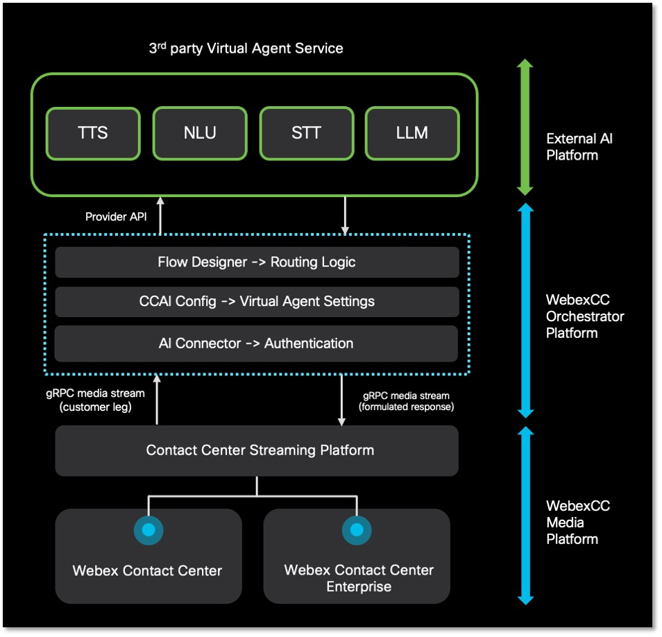
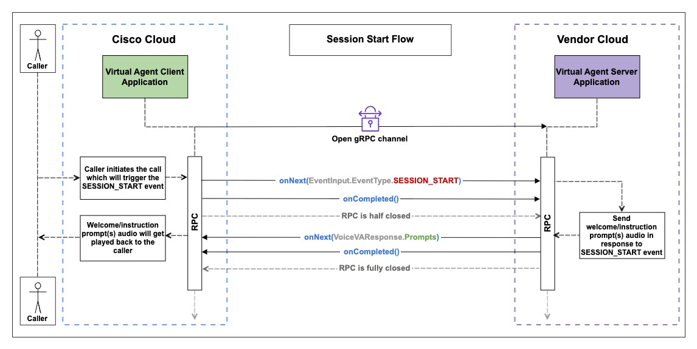
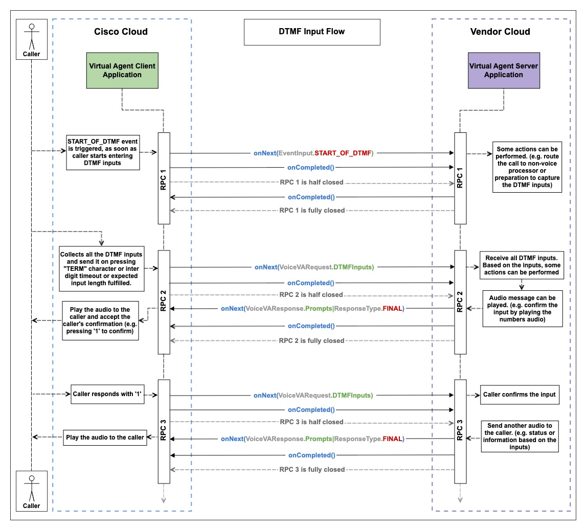
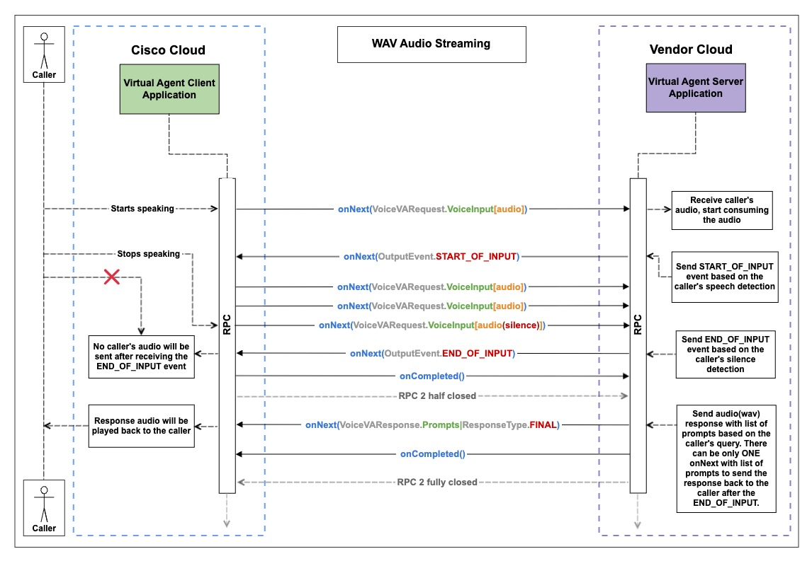
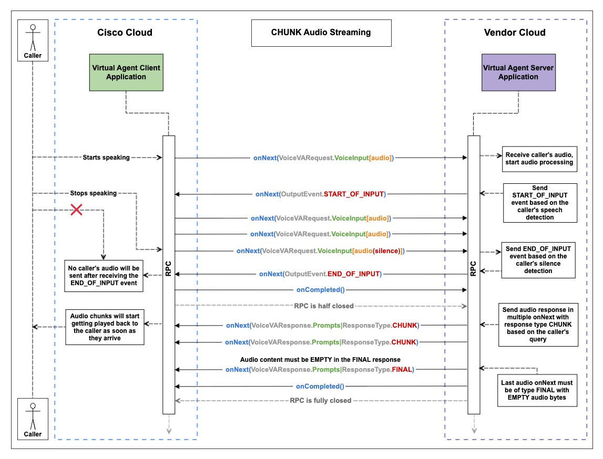
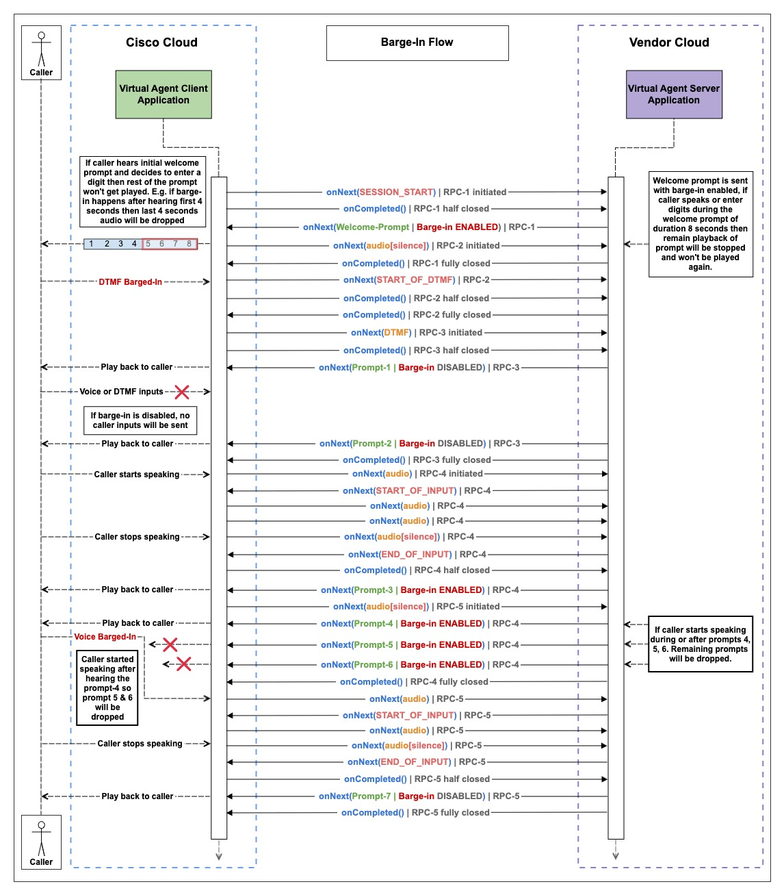
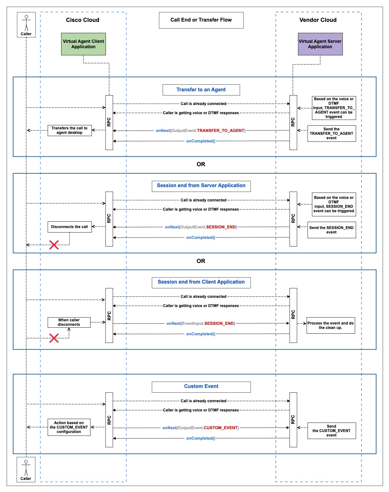
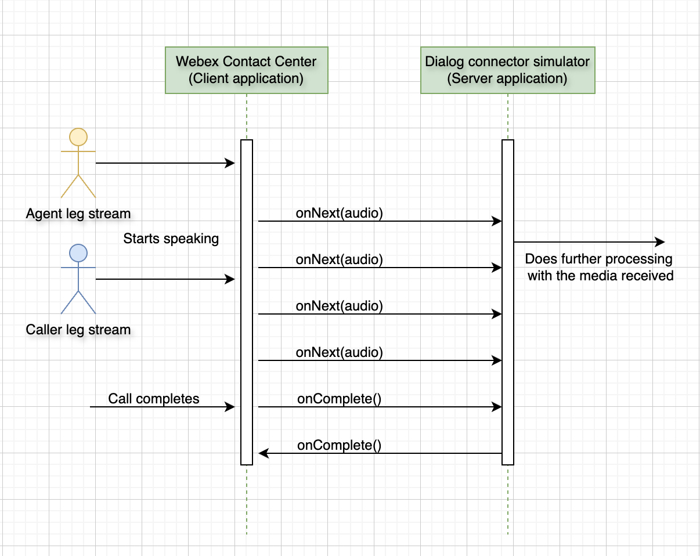

# Dialog Connector Simulator

A sample application demonstrating how to integrate external conversational interfaces with Webex Contact Center through gRPC services. This simulator supports both Bring Your Own Virtual Agent (BYoVA) and Media Forking capabilities.

## Table of Contents

- [Install](#install)
- [Usage](#usage)
- [Configuration](#configuration)
- [Troubleshooting](#troubleshooting)
- [API Reference](#api-reference)
  - [Bring Your Own Virtual Agent](#bring-your-own-virtual-agent)
  - [Media Forking](#media-forking)

## Install

### Prerequisites

1. **Java 17 or higher**
   ```bash
   java -version
   ```
   The output should show Java version 17 or higher.

2. **Apache Maven**
   ```bash
   mvn --version
   ```
   If not installed, download from [Apache Maven](https://maven.apache.org/download.cgi) or use a package manager:
   ```bash
   # macOS
   brew install maven
   
   # Ubuntu/Debian
   sudo apt-get install maven
   
   # CentOS/RHEL
   sudo yum install maven
   ```

3. **Set JAVA_HOME (if needed)**
   If you have multiple Java versions, ensure Maven uses Java 17:
   ```bash
   export JAVA_HOME=$(/usr/libexec/java_home -v 17)  # macOS
   # OR for Linux/Windows, set JAVA_HOME to your Java 17 installation path
   ```

### Build Steps

1. **Navigate to the project directory:**
   ```bash
   cd webex-contact-center-provider-sample-code/media-service-api/dialog-connector-simulator
   ```

2. **Build the Application:**
   ```bash
   mvn clean install
   ```
   
   This command will automatically:
   - Clean any previous builds
   - Clean any previous builds
   - Generate Java classes from protobuf definitions
   - Compile the Java source code
   - Package the application into JAR files

   **Alternative (if you encounter protobuf generation issues):**
   ```bash
   mvn clean
   mvn protobuf:compile protobuf:compile-custom
   mvn compile
   mvn install
   ```

## Usage

### Start the Server

**Recommended Method:**
```bash
java -jar target/dialog-connector-simulator-1.0.0-SNAPSHOT-allinone.jar
```

**Alternative Method:**
```bash
mvn exec:java -Dexec.mainClass="com.cisco.wccai.grpc.server.GrpcServer"
```
*Note: If you encounter compilation errors with this approach, use the JAR method instead.*

### Verify Server Startup

The server will start and listen for incoming gRPC connections on port 8086 (or the port configured in `config.properties`). You should see log output similar to:
```
2025-07-31 14:55:49 INFO  GrpcServer:37 - server started at port : 8086
```

**Note:** You may see warnings during the build process about protobuf imports and Maven shade plugin overlapping classes. These are normal and do not affect functionality.

### Make the Server Publicly Accessible

For integration with Webex Contact Center, your local server needs to be accessible via HTTPS. The recommended approach is to use **ngrok** to create a secure tunnel.

#### Option: Using ngrok (Recommended)

1. **Install ngrok** (if not already installed):
   ```bash
   # macOS
   brew install ngrok
   
   # Or download from https://ngrok.com/download
   ```

2. **Start your Dialog Connector server** (in one terminal):
   ```bash
   java -jar target/dialog-connector-simulator-1.0.0-SNAPSHOT-allinone.jar
   ```

3. **Create the ngrok tunnel** (in another terminal):
   ```bash
   ngrok http --upstream-protocol=http2 8086
   ```
   
   This command:
   - Creates an HTTPS tunnel to your local server on port 8086
   - Uses HTTP/2 upstream protocol (required for gRPC)
   - Provides both HTTP and HTTPS endpoints

4. **Copy the HTTPS URL** from ngrok output:
   ```
   Forwarding  https://abc123.ngrok-free.app -> http://localhost:8086
   ```

5. **Update your configuration**:
   - Copy the HTTPS URL (e.g., `https://abc123.ngrok-free.app`)
   - Update `DATASOURCE_URL` in `src/main/resources/config.properties`
   - Use this URL when configuring your Webex Contact Center integration
   - [Update your datasource](https://developer.webex.com/admin/docs/api/v1/data-sources/update-a-data-source) with the new URL


#### Important Notes

- **Restart ngrok**: Each time you restart ngrok, you'll get a new URL. Update your `config.properties` accordingly.
- **ngrok Free Tier**: URLs change on restart. Consider ngrok paid plans for persistent URLs in development.
- **Security**: These tools expose your local server to the internet. Only use for development and testing.
- **Webex Requirements**: Webex Contact Center requires HTTPS and may need the tunnel to support HTTP/2 for optimal gRPC performance.

## Configuration

Edit `src/main/resources/config.properties` to configure the application for your environment:

```properties
# For local development with ngrok, update this to your ngrok URL
DATASOURCE_URL = https://your-ngrok-id.ngrok-free.app

# Server settings
API_URL = localhost
PORT = 8086
USE_TLS = false

# Audio settings
AUDIO_ENCODING_TYPE = MULAW
SAMPLE_RATE_HERTZ = 8000
BUFFER_SIZE = 8192

# Other settings
LANGUAGE_CODE = en-US
ORG_ID = org_01
PROMPT_DURATION_MS = 10000
AUDIO_DURATION_MS = 60000
SAVE_INPUT_AUDIO = true
```

### Key Configuration Properties

#### JWT Validation Configuration
- **DATASOURCE_URL**: Must match the `com.cisco.datasource.url` claim in JWT tokens from Webex Contact Center
  - For local development with ngrok: `https://your-ngrok-id.ngrok-free.app` (copy from ngrok output)
  - For production: Your actual service URL (e.g., `https://your-domain.com:443`)
  - **Important**: This URL must be publicly accessible via HTTPS for Webex Contact Center integration

#### Server Configuration
- **API_URL**: Endpoint to connect (default: `localhost`)
- **PORT**: Server port - TLS: `443`, NonTLS: `31400` (default: `8086`)
- **USE_TLS**: Enable/disable TLS (default: `false`)

#### Audio Configuration
- **AUDIO_ENCODING_TYPE**: Supported types - `LINEAR16`, `MULAW` (default: `MULAW`)
- **SAMPLE_RATE_HERTZ**: Audio sample rate (default: `8000`)
- **BUFFER_SIZE**: Audio buffer size (default: `8192`)

**Important**: When using ngrok for local development, update the `DATASOURCE_URL` property with your current ngrok URL to avoid JWT validation failures. See [Make the Server Publicly Accessible](#make-the-server-publicly-accessible) for detailed ngrok setup instructions.

## Troubleshooting

### Build Issues

**Protobuf Generation Errors**
If you encounter "cannot find symbol" errors for `VoiceVirtualAgentGrpc` or `ConversationAudioGrpc` classes (this should be rare with the updated POM configuration):

1. Try the standard build process first:
   ```bash
   export JAVA_HOME=$(/usr/libexec/java_home -v 17)  # macOS
   mvn clean install
   ```

2. If the build still fails, run the protobuf generation explicitly:
   ```bash
   export JAVA_HOME=$(/usr/libexec/java_home -v 17)  # macOS
   mvn clean
   mvn protobuf:compile protobuf:compile-custom
   mvn compile
   ```

2. If the build still fails, run the protobuf generation explicitly:
   ```bash
   export JAVA_HOME=$(/usr/libexec/java_home -v 17)  # macOS
   mvn clean
   mvn protobuf:compile protobuf:compile-custom
   mvn compile
   ```

3. **For system compatibility issues only** - If the Maven protobuf plugin generates empty files, use manual generation (see the previous version of this documentation for detailed manual steps).

4. Alternative approach - use the generate-sources phase explicitly:
   ```bash
   export JAVA_HOME=$(/usr/libexec/java_home -v 17)  # macOS
   mvn clean generate-sources compile install
   ```

**Java Version Mismatch**
If you encounter compilation errors like "error reading protobuf generated files":
1. Verify Java 17 is installed: `java -version`
2. Set JAVA_HOME explicitly:
   ```bash
   export JAVA_HOME=$(/usr/libexec/java_home -v 17)  # macOS
   mvn clean install
   ```
3. Check Maven is using correct Java version: `mvn --version`

**Maven Exec Plugin Issues**
If `mvn exec:java` fails with compilation errors, use the JAR approach instead:
```bash
java -jar target/dialog-connector-simulator-1.0.0-SNAPSHOT-allinone.jar
```

**Build Process Verification**
1. Run `mvn clean install` - should complete with "BUILD SUCCESS"
2. Check JAR exists: `ls -la target/dialog-connector-simulator-1.0.0-SNAPSHOT-allinone.jar`
3. Start server and look for: "server started at port : 8086"

### JWT Claims Validation Failed

**Datasource URL Mismatch** (Most Common)
Update `DATASOURCE_URL` in `config.properties` to match your current service URL.
For ngrok users: Update the URL whenever you restart ngrok (see [Make the Server Publicly Accessible](#make-the-server-publicly-accessible) for setup details).

**Missing Required JWT Claims**
Ensure your JWT token contains:
- `iss` (issuer) - must be a valid Webex issuer
- `aud` (audience), `sub` (subject), `jti` (JWT ID) - must be present
- `com.cisco.datasource.url` - must match your `DATASOURCE_URL`
- `com.cisco.datasource.schema.uuid` - must be `5397013b-7920-4ffc-807c-e8a3e0a18f43`

**Valid Webex Issuers:**
- `https://idbrokerbts.webex.com/idb`
- `https://idbrokerbts-eu.webex.com/idb`
- `https://idbroker.webex.com/idb`
- `https://idbroker-eu.webex.com/idb`
- `https://idbroker-b-us.webex.com/idb`
- `https://idbroker-ca.webex.com/idb`

**Debugging**: Use [jwt.io](https://jwt.io) to decode and verify your JWT token claims.

## API Reference

### Bring Your Own Virtual Agent

The Bring Your Own Virtual Agent (BYoVA) Initiative empowers developers and AI vendors to seamlessly integrate external conversational interfaces with Webex Contact Center IVR.

**Code Overview**: The Dialog Connector represents a **gRPC Server Application** (`src/main/java/com/cisco/wccai/grpc/server/GrpcServer.java`) that listens for incoming requests from the Webex CC VA Client Application, which is a **gRPC Client Application** (`src/main/java/com/cisco/wccai/grpc/client/VoiceVAClient.java`).

**Protocol Definition**: `src/main/proto/com/cisco/wcc/ccai/media/v1/VoiceVirtualAgent.proto`

**Reference**: [Dialog Connector Simulator Sample Code](https://github.com/CiscoDevNet/webex-contact-center-ai-sample-code/tree/main/provider-api/dialog-connector-simulator)

#### Onboarding Steps


*Fig 2: Architectural Diagram for provisioning a Virtual Agent*

General guidelines for customer/partner onboarding are mentioned in the [main README](../../README.md).

#### gRPC Bi-directional Streaming Guidelines
1. `onNext`, `onError`, and `onCompleted` are gRPC methods defined in the [StreamObserver<T>](https://grpc.github.io/grpc-java/javadoc/io/grpc/stub/StreamObserver.html) interface for Java. Method names and API signatures vary by language-specific implementations of the gRPC library. See [gRPC documentation](https://grpc.io/docs/languages/) for details.
2. For each RPC, `onCompleted` will be called from the VA Client side after all data has been sent (half-closed). Once the VA Server has finished sending all responses for the same RPC, `onCompleted` must be called to fully close the RPC.
3. Each RPC must be closed by calling `onCompleted` in the end, except in cases of unexpected call termination scenarios.

#### Virtual Agent Streaming and Event Handling Guidelines
1. The sequence of events must follow the same order as outlined in the sequence diagrams
2. Welcome prompt should be sent in response to the [SESSION_START](https://github.com/webex/dataSourceSchemas/blob/f625b9f80dd0673bc0da01f443e31104a1a66dbd/Services/VoiceVirtualAgent_5397013b-7920-4ffc-807c-e8a3e0a18f43/Proto/byova_common.proto#L182) event
3. Sending [END_OF_INPUT](https://github.com/webex/dataSourceSchemas/blob/f625b9f80dd0673bc0da01f443e31104a1a66dbd/Services/VoiceVirtualAgent_5397013b-7920-4ffc-807c-e8a3e0a18f43/Proto/byova_common.proto#L162) will immediately stop the caller's audio streaming (except when [barge-in](https://github.com/webex/dataSourceSchemas/blob/f625b9f80dd0673bc0da01f443e31104a1a66dbd/Services/VoiceVirtualAgent_5397013b-7920-4ffc-807c-e8a3e0a18f43/Proto/voicevirtualagent.proto#L123) is enabled)
4. If the caller provides no input within the configured timeout, [NO_INPUT](https://github.com/webex/dataSourceSchemas/blob/f625b9f80dd0673bc0da01f443e31104a1a66dbd/Services/VoiceVirtualAgent_5397013b-7920-4ffc-807c-e8a3e0a18f43/Proto/byova_common.proto#L185) event will be triggered
5. Switch between Voice and DTMF by setting the required [INPUT_MODE](https://github.com/webex/dataSourceSchemas/blob/f625b9f80dd0673bc0da01f443e31104a1a66dbd/Services/VoiceVirtualAgent_5397013b-7920-4ffc-807c-e8a3e0a18f43/Proto/voicevirtualagent.proto#L91) in the [VoiceVAResponse](https://github.com/webex/dataSourceSchemas/blob/f625b9f80dd0673bc0da01f443e31104a1a66dbd/Services/VoiceVirtualAgent_5397013b-7920-4ffc-807c-e8a3e0a18f43/Proto/voicevirtualagent.proto#L77):
   - [INPUT_VOICE](https://github.com/webex/dataSourceSchemas/blob/f625b9f80dd0673bc0da01f443e31104a1a66dbd/Services/VoiceVirtualAgent_5397013b-7920-4ffc-807c-e8a3e0a18f43/Proto/voicevirtualagent.proto#L129) - Only Voice input accepted
   - [INPUT_EVENT_DTMF](https://github.com/webex/dataSourceSchemas/blob/f625b9f80dd0673bc0da01f443e31104a1a66dbd/Services/VoiceVirtualAgent_5397013b-7920-4ffc-807c-e8a3e0a18f43/Proto/voicevirtualagent.proto#L130) - Only DTMF input accepted
   - [INPUT_VOICE_DTMF](https://github.com/webex/dataSourceSchemas/blob/f625b9f80dd0673bc0da01f443e31104a1a66dbd/Services/VoiceVirtualAgent_5397013b-7920-4ffc-807c-e8a3e0a18f43/Proto/voicevirtualagent.proto#L131) - Both Voice and DTMF inputs accepted


### Detailed Flow with Sequence Diagram
### Step 1. Start of Conversation
1. The Dialog Connector will start up as a gRPC Virtual Agent Server Application (**VA Server**).
2. When the caller's call is connected, the VA Client establishes a gRPC connection with the VA Server by creating a new conversation (`conversation_id`) and sending a [VoiceVARequest](https://github.com/webex/dataSourceSchemas/blob/f625b9f80dd0673bc0da01f443e31104a1a66dbd/Services/VoiceVirtualAgent_5397013b-7920-4ffc-807c-e8a3e0a18f43/Proto/voicevirtualagent.proto#L16) to the VA Server with SESSION_START event. The `conversation_id` is used for the entire conversation between the VA Client and VA Server. The request is sent without any audio data.
3. [SESSION_START](https://github.com/webex/dataSourceSchemas/blob/f625b9f80dd0673bc0da01f443e31104a1a66dbd/Services/VoiceVirtualAgent_5397013b-7920-4ffc-807c-e8a3e0a18f43/Proto/byova_common.proto#L182) can be used by the connector to start the session with its AI Service and return a response back to the Client using [ViceVAResponse](https://github.com/webex/dataSourceSchemas/blob/f625b9f80dd0673bc0da01f443e31104a1a66dbd/Services/VoiceVirtualAgent_5397013b-7920-4ffc-807c-e8a3e0a18f43/Proto/voicevirtualagent.proto#L77). It could contain response payloads, prompts, NLU data, and input mode for handling the next interactions from the Caller. Prompts contain the audio which needs to be played to the Caller. It can return one or multiple prompts in a response. Prompts are played one after another at the client side in the sequence of receiving.
4. New RPC is initiated with [SESSION_START](https://github.com/webex/dataSourceSchemas/blob/f625b9f80dd0673bc0da01f443e31104a1a66dbd/Services/VoiceVirtualAgent_5397013b-7920-4ffc-807c-e8a3e0a18f43/Proto/byova_common.proto#L182) event of type [EVENT_INPUT](https://github.com/webex/dataSourceSchemas/blob/f625b9f80dd0673bc0da01f443e31104a1a66dbd/Services/VoiceVirtualAgent_5397013b-7920-4ffc-807c-e8a3e0a18f43/Proto/voicevirtualagent.proto#L41) from VA Client to VA Server.
5. Once prompt is sent, VA Server should call onCompleted. RPC is completed. A new RPC will be initiated to handle further events.




### Step 2. DTMF Input Flow
1. If caller enters DTMF input by pressing numbers on the phone's keypad then the new RPC-1 gets initiated with [START_OF_DTMF](https://github.com/webex/dataSourceSchemas/blob/f625b9f80dd0673bc0da01f443e31104a1a66dbd/Services/VoiceVirtualAgent_5397013b-7920-4ffc-807c-e8a3e0a18f43/Proto/byova_common.proto#L186) event of type [EVENT_INPUT](https://github.com/webex/dataSourceSchemas/blob/f625b9f80dd0673bc0da01f443e31104a1a66dbd/Services/VoiceVirtualAgent_5397013b-7920-4ffc-807c-e8a3e0a18f43/Proto/voicevirtualagent.proto#L41) from VA Client to VA Server. 
2. [START_OF_DTMF](https://github.com/webex/dataSourceSchemas/blob/f625b9f80dd0673bc0da01f443e31104a1a66dbd/Services/VoiceVirtualAgent_5397013b-7920-4ffc-807c-e8a3e0a18f43/Proto/byova_common.proto#L186) event indicates that the caller is entering DTMF inputs. Based on this event, specific actions can be taken, such as populating required values or updating flags. 
3. In response to [START_OF_DTMF](https://github.com/webex/dataSourceSchemas/blob/f625b9f80dd0673bc0da01f443e31104a1a66dbd/Services/VoiceVirtualAgent_5397013b-7920-4ffc-807c-e8a3e0a18f43/Proto/byova_common.proto#L186) event, onCompleted should be called to complete the RPC-1. 
4. Once the caller has finished entering the DTMF input, it will be sent to VA Server when one of the following conditions is met:
   - [DTMF input length](https://github.com/webex/dataSourceSchemas/blob/f625b9f80dd0673bc0da01f443e31104a1a66dbd/Services/VoiceVirtualAgent_5397013b-7920-4ffc-807c-e8a3e0a18f43/Proto/byova_common.proto#L100) requirement is satisfied, meaning the expected number of digits has been entered.
   - An [inter-digit timeout](https://github.com/webex/dataSourceSchemas/blob/f625b9f80dd0673bc0da01f443e31104a1a66dbd/Services/VoiceVirtualAgent_5397013b-7920-4ffc-807c-e8a3e0a18f43/Proto/byova_common.proto#L98) occurs.
   - [Termination character](https://github.com/webex/dataSourceSchemas/blob/f625b9f80dd0673bc0da01f443e31104a1a66dbd/Services/VoiceVirtualAgent_5397013b-7920-4ffc-807c-e8a3e0a18f43/Proto/byova_common.proto#L99) is pressed.

5. RPC-2 is initiated with the DTMF inputs of type [DTMF_INPUT](https://github.com/webex/dataSourceSchemas/blob/f625b9f80dd0673bc0da01f443e31104a1a66dbd/Services/VoiceVirtualAgent_5397013b-7920-4ffc-807c-e8a3e0a18f43/Proto/voicevirtualagent.proto#L38). 
6. Received DTMF inputs or digits can be process according to the use case. For example, an audio prompt can be sent to confirm the DTMF entries by pressing '1' in onNext followed by onCompleted. RPC-2 is completed. 
7. Caller confirms the previously entered DTMF inputs by pressing '1', RPC-3 is initiated with caller's confirmation DTMF input. 
8. Another prompt can be sent in response to caller's confirmation. For example, an audio prompt with status or information based on the DTMF inputs in onNext followed by onCompleted. RPC-3 is completed.



### Step 3. Audio Input Flow
At the start of the call, the VA Server must choose between WAV Streaming and CHUNK Streaming, this decision should not be altered during the call. For scripted virtual agents where prompts are pre configured VA Server should use WAV streaming and for longer prompts with LLM models, VA Server should use CHUNK streaming.
   - In the case of WAV Streaming, always send the response as [FINAL](https://github.com/webex/dataSourceSchemas/blob/f625b9f80dd0673bc0da01f443e31104a1a66dbd/Services/VoiceVirtualAgent_5397013b-7920-4ffc-807c-e8a3e0a18f43/Proto/voicevirtualagent.proto#L110) in single onNext with the WAV header in the audio, followed by onCompleted.
   - In the case of CHUNK Streaming, always send a [FINAL](https://github.com/webex/dataSourceSchemas/blob/f625b9f80dd0673bc0da01f443e31104a1a66dbd/Services/VoiceVirtualAgent_5397013b-7920-4ffc-807c-e8a3e0a18f43/Proto/voicevirtualagent.proto#L110) response with EMPTY audio after all the [CHUNK](https://github.com/webex/dataSourceSchemas/blob/f625b9f80dd0673bc0da01f443e31104a1a66dbd/Services/VoiceVirtualAgent_5397013b-7920-4ffc-807c-e8a3e0a18f43/Proto/voicevirtualagent.proto#L112) responses, followed by onCompleted. Minimum [CHUNK](https://github.com/webex/dataSourceSchemas/blob/f625b9f80dd0673bc0da01f443e31104a1a66dbd/Services/VoiceVirtualAgent_5397013b-7920-4ffc-807c-e8a3e0a18f43/Proto/voicevirtualagent.proto#L112) size is 100 bytes, and there is no maximum limit. It is recommended to keep the [CHUNK](https://github.com/webex/dataSourceSchemas/blob/f625b9f80dd0673bc0da01f443e31104a1a66dbd/Services/VoiceVirtualAgent_5397013b-7920-4ffc-807c-e8a3e0a18f43/Proto/voicevirtualagent.proto#L112) size as large as possible.
   
### Step 3.1. WAV Audio Streaming
1. If caller starts speaking, a new RPC is initiated with caller's audio from VA Client to VA Server. 
2. VA Server should be capable of detecting both the caller's speech and silence. 
3. Once the caller's speech is detected, send the [START_OF_INPUT](https://github.com/webex/dataSourceSchemas/blob/f625b9f80dd0673bc0da01f443e31104a1a66dbd/Services/VoiceVirtualAgent_5397013b-7920-4ffc-807c-e8a3e0a18f43/Proto/byova_common.proto#L160) event in the onNext. 
4. Continue to consume the audio from the caller until silence is detected. 
5. Once silence is detected, send the [END_OF_INPUT](https://github.com/webex/dataSourceSchemas/blob/f625b9f80dd0673bc0da01f443e31104a1a66dbd/Services/VoiceVirtualAgent_5397013b-7920-4ffc-807c-e8a3e0a18f43/Proto/byova_common.proto#L162) event. [Please note that sending the [END_OF_INPUT](https://github.com/webex/dataSourceSchemas/blob/f625b9f80dd0673bc0da01f443e31104a1a66dbd/Services/VoiceVirtualAgent_5397013b-7920-4ffc-807c-e8a3e0a18f43/Proto/byova_common.proto#L162) will immediately stop streaming the caller's audio to the VA Server.]
6. VA Server must wait for the response generation to complete so that all responses can be sent in onNext. [Audio must have a WAV header for each onNext.]
7. Send all responses in one or as a list of prompts with the response type [FINAL](https://github.com/webex/dataSourceSchemas/blob/f625b9f80dd0673bc0da01f443e31104a1a66dbd/Services/VoiceVirtualAgent_5397013b-7920-4ffc-807c-e8a3e0a18f43/Proto/voicevirtualagent.proto#L110) in a single onNext, followed by onCompleted. RPC is completed. [More than one onNext is not permitted to send the responses with the response type [FINAL](https://github.com/webex/dataSourceSchemas/blob/f625b9f80dd0673bc0da01f443e31104a1a66dbd/Services/VoiceVirtualAgent_5397013b-7920-4ffc-807c-e8a3e0a18f43/Proto/voicevirtualagent.proto#L110).]



### Step 3.2. CHUNK Audio Streaming
1. If caller starts speaking, a new RPC is initiated with caller's audio from VA Client to VA Server. 
2. VA Server should be capable of detecting both the caller's speech and silence. 
3. Once the caller's speech is detected, send the [START_OF_INPUT](https://github.com/webex/dataSourceSchemas/blob/f625b9f80dd0673bc0da01f443e31104a1a66dbd/Services/VoiceVirtualAgent_5397013b-7920-4ffc-807c-e8a3e0a18f43/Proto/byova_common.proto#L160) event in the onNext. 
4. Continue to consume the audio from the caller until silence is detected. 
5. Once silence is detected, send the [END_OF_INPUT](https://github.com/webex/dataSourceSchemas/blob/f625b9f80dd0673bc0da01f443e31104a1a66dbd/Services/VoiceVirtualAgent_5397013b-7920-4ffc-807c-e8a3e0a18f43/Proto/byova_common.proto#L162) event. [Please note that sending the [END_OF_INPUT](https://github.com/webex/dataSourceSchemas/blob/f625b9f80dd0673bc0da01f443e31104a1a66dbd/Services/VoiceVirtualAgent_5397013b-7920-4ffc-807c-e8a3e0a18f43/Proto/byova_common.proto#L162) will immediately stop streaming the caller's audio to the VA Server.]
6. VA Server does not need to wait for the response generation to finish. Audio responses can be sent in multiple onNext calls with the response type [CHUNK](https://github.com/webex/dataSourceSchemas/blob/f625b9f80dd0673bc0da01f443e31104a1a66dbd/Services/VoiceVirtualAgent_5397013b-7920-4ffc-807c-e8a3e0a18f43/Proto/voicevirtualagent.proto#L112), without WAV headers, as soon as they are ready. 
7. Last onNext must have EMPTY audio/bytes and response type must be [FINAL](https://github.com/webex/dataSourceSchemas/blob/f625b9f80dd0673bc0da01f443e31104a1a66dbd/Services/VoiceVirtualAgent_5397013b-7920-4ffc-807c-e8a3e0a18f43/Proto/voicevirtualagent.proto#L110). 
8. Send the onCompleted after [FINAL](https://github.com/webex/dataSourceSchemas/blob/f625b9f80dd0673bc0da01f443e31104a1a66dbd/Services/VoiceVirtualAgent_5397013b-7920-4ffc-807c-e8a3e0a18f43/Proto/voicevirtualagent.proto#L110) onNext, RPC is completed.



### Step 4. Barge-In Prompts
Every prompt will have an config option to set [barge-in](https://github.com/webex/dataSourceSchemas/blob/f625b9f80dd0673bc0da01f443e31104a1a66dbd/Services/VoiceVirtualAgent_5397013b-7920-4ffc-807c-e8a3e0a18f43/Proto/voicevirtualagent.proto#L123) to TRUE or FALSE. If barge-in is enabled, any prompt with any [ResponseType (CHUNK, FINAL, PARTIAL)](https://github.com/webex/dataSourceSchemas/blob/f625b9f80dd0673bc0da01f443e31104a1a66dbd/Services/VoiceVirtualAgent_5397013b-7920-4ffc-807c-e8a3e0a18f43/Proto/voicevirtualagent.proto#L109) or [VoiceVAInputMode](https://github.com/webex/dataSourceSchemas/blob/f625b9f80dd0673bc0da01f443e31104a1a66dbd/Services/VoiceVirtualAgent_5397013b-7920-4ffc-807c-e8a3e0a18f43/Proto/voicevirtualagent.proto#L127) will be barged-in on caller's input except termination or transfer event prompts. The following sequence diagram uses the [INPUT_VOICE_DTMF](https://github.com/webex/dataSourceSchemas/blob/f625b9f80dd0673bc0da01f443e31104a1a66dbd/Services/VoiceVirtualAgent_5397013b-7920-4ffc-807c-e8a3e0a18f43/Proto/voicevirtualagent.proto#L131) input mode that means every new RPC will contain silent audio packets until caller speaks and the same applies to [INPUT_VOICE](https://github.com/webex/dataSourceSchemas/blob/f625b9f80dd0673bc0da01f443e31104a1a66dbd/Services/VoiceVirtualAgent_5397013b-7920-4ffc-807c-e8a3e0a18f43/Proto/voicevirtualagent.proto#L129) as well. If the input mode is [INPUT_EVENT_DTMF](https://github.com/webex/dataSourceSchemas/blob/f625b9f80dd0673bc0da01f443e31104a1a66dbd/Services/VoiceVirtualAgent_5397013b-7920-4ffc-807c-e8a3e0a18f43/Proto/voicevirtualagent.proto#L130), a new RPC will be triggered upon DTMF input submission from the caller's end.

1. After [SESSION_START](https://github.com/webex/dataSourceSchemas/blob/f625b9f80dd0673bc0da01f443e31104a1a66dbd/Services/VoiceVirtualAgent_5397013b-7920-4ffc-807c-e8a3e0a18f43/Proto/byova_common.proto#L182), RPC-1 gets half-closed, which means the VA Client cannot send anything in RPC-1. Since [barge-in](https://github.com/webex/dataSourceSchemas/blob/f625b9f80dd0673bc0da01f443e31104a1a66dbd/Services/VoiceVirtualAgent_5397013b-7920-4ffc-807c-e8a3e0a18f43/Proto/voicevirtualagent.proto#L123) is enabled, RPC-2 is initiated. 
2. VA Server sends a Welcome-Prompt of duration 8 seconds with [barge-in](https://github.com/webex/dataSourceSchemas/blob/f625b9f80dd0673bc0da01f443e31104a1a66dbd/Services/VoiceVirtualAgent_5397013b-7920-4ffc-807c-e8a3e0a18f43/Proto/voicevirtualagent.proto#L123) enabled, followed by onCompleted. RPC-1 is completed. 
3. RPC-2 initially has silence audio, but as soon as the caller enters DTMF input after hearing 4 seconds of the prompt, it barges in on the Welcome-Prompt playback in the middle and sends the [START_OF_DTMF](https://github.com/webex/dataSourceSchemas/blob/f625b9f80dd0673bc0da01f443e31104a1a66dbd/Services/VoiceVirtualAgent_5397013b-7920-4ffc-807c-e8a3e0a18f43/Proto/byova_common.proto#L186) event to the VA Server. 
4. VA Server responds to [START_OF_DTMF](https://github.com/webex/dataSourceSchemas/blob/f625b9f80dd0673bc0da01f443e31104a1a66dbd/Services/VoiceVirtualAgent_5397013b-7920-4ffc-807c-e8a3e0a18f43/Proto/byova_common.proto#L186) event with onCompleted. RPC-2 is completed. 
5. RPC-3 is initiated with DTMF inputs, VA Server receives the DTMF inputs and sends Prompt-1 and Prompt-2 with [barge-in](https://github.com/webex/dataSourceSchemas/blob/f625b9f80dd0673bc0da01f443e31104a1a66dbd/Services/VoiceVirtualAgent_5397013b-7920-4ffc-807c-e8a3e0a18f43/Proto/voicevirtualagent.proto#L123) disabled. 
6. Prompt-1 and Prompt-2 cannot be barged in and will be played completely even if the caller tries to speak or provide DTMF input. The caller's input at this point will be dropped. 
7. RPC-3 is completed and RPC-4 is initiated with caller's audio and VA Server detects caller's speech and sends [START_OF_INPUT](https://github.com/webex/dataSourceSchemas/blob/f625b9f80dd0673bc0da01f443e31104a1a66dbd/Services/VoiceVirtualAgent_5397013b-7920-4ffc-807c-e8a3e0a18f43/Proto/byova_common.proto#L160) event. 
8. VA Server collects caller's audio until silence is detected and then sends [END_OF_INPUT](https://github.com/webex/dataSourceSchemas/blob/f625b9f80dd0673bc0da01f443e31104a1a66dbd/Services/VoiceVirtualAgent_5397013b-7920-4ffc-807c-e8a3e0a18f43/Proto/byova_common.proto#L162) event. 
9. VA Server sends 4 prompts with [barge-in](https://github.com/webex/dataSourceSchemas/blob/f625b9f80dd0673bc0da01f443e31104a1a66dbd/Services/VoiceVirtualAgent_5397013b-7920-4ffc-807c-e8a3e0a18f43/Proto/voicevirtualagent.proto#L123) enabled and RPC-5 is initiated. 
10. Prompt-3 and Prompt-4 are played back to the caller, and then the caller barges in, causing Prompt-5 and Prompt-6 to be dropped. 
11. VA Server detects caller's speech and sends [START_OF_INPUT](https://github.com/webex/dataSourceSchemas/blob/f625b9f80dd0673bc0da01f443e31104a1a66dbd/Services/VoiceVirtualAgent_5397013b-7920-4ffc-807c-e8a3e0a18f43/Proto/byova_common.proto#L160) event again and collects audio until the silence is detected. 
12. Upon detecting silence, the VA Server sends an [END_OF_INPUT](https://github.com/webex/dataSourceSchemas/blob/f625b9f80dd0673bc0da01f443e31104a1a66dbd/Services/VoiceVirtualAgent_5397013b-7920-4ffc-807c-e8a3e0a18f43/Proto/byova_common.proto#L162) event, and the last Prompt-7, with [barge-in](https://github.com/webex/dataSourceSchemas/blob/f625b9f80dd0673bc0da01f443e31104a1a66dbd/Services/VoiceVirtualAgent_5397013b-7920-4ffc-807c-e8a3e0a18f43/Proto/voicevirtualagent.proto#L123) disabled, will be played back to the caller.





### Step 5. Call Termination, Transfer, and Custom Event
Call can be terminated, transferred to an agent, or a custom action can be performed, such as sending the caller to another queue.

1. Transfer to agent: An ongoing call with a virtual agent can be transferred to a live agent by sending the [TRANSFER_TO_AGENT](https://github.com/webex/dataSourceSchemas/blob/f625b9f80dd0673bc0da01f443e31104a1a66dbd/Services/VoiceVirtualAgent_5397013b-7920-4ffc-807c-e8a3e0a18f43/Proto/byova_common.proto#L153) output event, along with an optional audio prompt. 
2. Session end from server application: Call can be disconnected from the VA Server side by sending the [SESSION_END](https://github.com/webex/dataSourceSchemas/blob/f625b9f80dd0673bc0da01f443e31104a1a66dbd/Services/VoiceVirtualAgent_5397013b-7920-4ffc-807c-e8a3e0a18f43/Proto/byova_common.proto#L152) output event, along with an optional audio prompt. 
3. Session end from client application: When the caller disconnects the call, a [SESSION_END](https://github.com/webex/dataSourceSchemas/blob/f625b9f80dd0673bc0da01f443e31104a1a66dbd/Services/VoiceVirtualAgent_5397013b-7920-4ffc-807c-e8a3e0a18f43/Proto/byova_common.proto#L183) input event will be sent to the VA Server, and no prompt can be sent. 
4. Custom event: [CUSTOM_EVENT](https://github.com/webex/dataSourceSchemas/blob/f625b9f80dd0673bc0da01f443e31104a1a66dbd/Services/VoiceVirtualAgent_5397013b-7920-4ffc-807c-e8a3e0a18f43/Proto/byova_common.proto#L154) can be sent to perform preconfigured custom actions.



### Media Forking

Media Forking allows customers to access real-time media streams of interactions between human agents and callers in Webex Contact Center.

**Code Overview**: The dialog connector simulator server represents a **gRPC Server Application** (`src/main/java/com/cisco/wccai/grpc/server/GrpcServer.java`) that listens for incoming requests from Webex Contact Center.

**Protocol Definition**: `src/main/proto/com/cisco/wcc/ccai/media/v1/conversationaudioforking.proto`

**Reference**: [Dialog Connector Simulator Sample Code](https://github.com/CiscoDevNet/webex-contact-center-provider-sample-code/tree/main/media-service-api/dialog-connector-simulator)

The protocol implements bidirectional streaming RPC where the client (Webex Contact Center) streams audio during the call and the server (customer/partner) sends acknowledgment when `onComplete()` is received.

#### Detailed Flow with Sequence Diagram



> **Note**: Customers using this feature should implement logic for further processing of received media based on their requirements. The simulator code does not perform any processing of received audio.