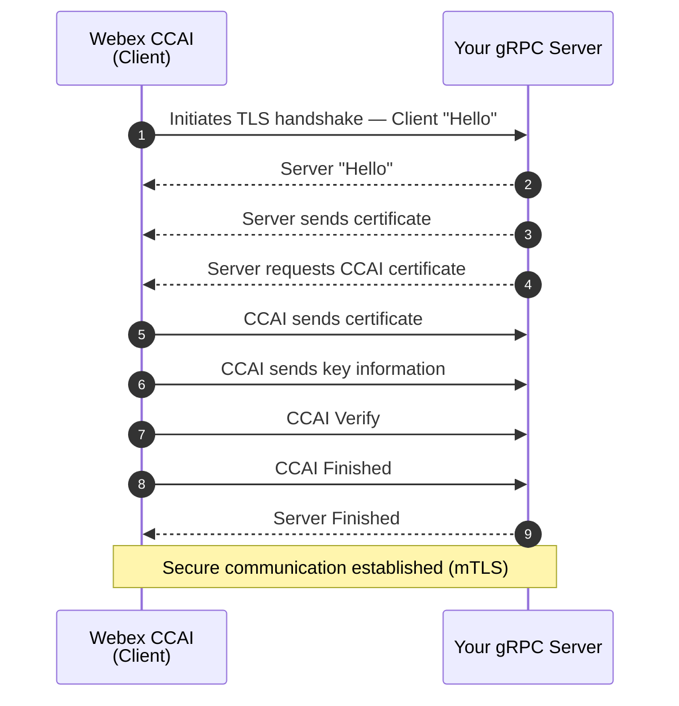

# mTLS (Mutual TLS) authentication

mTLS (Mutual TLS) is an extension of TLS (Transport Layer Security) that ensures both the `Webex CCAI` (client) and your server authenticate each other during communication. Unlike standard TLS, which only authenticates the server to the `Webex CCAI`, mTLS requires both parties to present and validate certificates, providing bidirectional authentication. mTLS is used to provide an additional transport-layer security and mutual authentication on top of (not in place of) the JWS/JWT validation that every connection must already perform. It is **optional** and supported by the `Webex CCAI` platform.

This optional authentication method is currently available for the following features:

- Bring Your Own Virtual Agent (BYoVA)
- Real-Time Media Forking

It applies to the gRPC variants of these features. The reference Java samples it can be wired into are:

- [`bring-your-own/virtual-agent/grpc-interface/simulators/byova-grpc-java/`](./bring-your-own/virtual-agent/grpc-interface/simulators/byova-grpc-java/)
- [`media-forking/simulators/media-forking-java/`](./media-forking/simulators/media-forking-java/)

## mTLS Handshake Process

The diagram below shows the full mTLS handshake exchanged between the `Webex CCAI` (client) and your gRPC server before any application data is sent.



GitHub renders Mermaid blocks natively, so the diagram is visible inline when this file is viewed on github.com.

## Getting started with mTLS

### Keywords
- **Server Certificate**: Publicly issued certificate used by your gRPC server to verify its identity to the `Webex CCAI`.
- **Server Private Key**: Used by your server for the TLS key exchange.
- **IdenTrust Root CA Certificate**: Used by your server to validate the `Webex CCAI` client certificate. This can be downloaded from [IdenTrust](https://www.identrust.com/identrust-commercial-root-ca-1).
- **Webex CCAI Certificate**: The certificate presented by the `Webex CCAI` during the handshake. This is provided by Cisco and is used to verify the identity of the `Webex CCAI`.

### `Webex CCAI` Certificate Details
The CN (Subject's Common Name) and other Subject fields of the `Webex CCAI` certificate vary by environment and region. Refer to the Webex CC documentation for your tenant to obtain the exact certificate Subject your server should expect during the mTLS handshake, and pin/validate against that value in your interceptor.

## Wiring mTLS into the gRPC samples

The example below shows the changes required in either of the gRPC Java sample modules listed above (`byova-grpc-java` or `media-forking-java`). The principles apply equally to a Python or any other gRPC server implementation.

### 1. Configure the gRPC server with an SSL context

Update your `GrpcServer` (e.g. `.../grpc/GrpcServer.java`) to configure SSL using Netty. The server loads the IdenTrust root CA certificate (used to validate the `Webex CCAI` client certificate) and uses its own private key and certificate to present its identity.

> **NOTE**: Your server must explicitly require the `Webex CCAI` certificate during the TLS handshake by setting `clientAuth(ClientAuth.REQUIRE)` in the SSL context configuration.

```java
// Path to the server certificate file
File certFile = new File("../your-server.crt");
// Path to the server private key file
File keyFile = new File("../your-server.key");
// Path to the IdenTrust root CA certificate file (used to validate the Webex CCAI client cert)
File caCert = new File("../identrust-commercial-root-ca.crt");

// SSL context configuration for the gRPC server
SslContext sslContext = GrpcSslContexts
        .configure(SslContextBuilder.forServer(certFile, keyFile)) // Load the server cert & key
        .trustManager(caCert)                                      // Trust the IdenTrust root CA
        .clientAuth(ClientAuth.REQUIRE)                            // Require a client certificate
        .build();

// Create the gRPC server with the SSL context
Server server = NettyServerBuilder.forPort(PORT)
        .sslContext(sslContext)                            // Enable TLS for this server
        .intercept(new ClientCertificateInterceptor())     // Validate the peer certificate
        // ... add your existing service & interceptor registrations here ...
        .build()
        .start();
```

### 2. Add an interceptor to verify the Webex CCAI certificate

Add a `ClientCertificateInterceptor` to extract and validate the client certificate presented during the handshake. Pin the validation against the Subject details published in your tenant's Webex CC documentation.

```java
public class ClientCertificateInterceptor implements ServerInterceptor {

    @Override
    public <ReqT, RespT> ServerCall.Listener<ReqT> interceptCall(
            ServerCall<ReqT, RespT> call,
            Metadata headers,
            ServerCallHandler<ReqT, RespT> next) {

        // Extract the SSL session from the call attributes
        SSLSession sslSession = call.getAttributes().get(Grpc.TRANSPORT_ATTR_SSL_SESSION);
        if (sslSession == null) {
            throw new StatusRuntimeException(
                    Status.UNAUTHENTICATED.withDescription("SSL session not found"));
        }

        try {
            Certificate[] peerCerts = sslSession.getPeerCertificates();
            if (peerCerts == null || peerCerts.length == 0) {
                throw new StatusRuntimeException(
                        Status.UNAUTHENTICATED.withDescription("Client certificate is required"));
            }

            // Validate the client certificate against the expected Webex CCAI certificate
            validateClientCertificate((X509Certificate) peerCerts[0]);
        } catch (Exception e) {
            throw new StatusRuntimeException(
                    Status.UNAUTHENTICATED.withDescription("Invalid client certificate: " + e.getMessage()));
        }

        return next.startCall(call, headers);
    }

    private void validateClientCertificate(X509Certificate clientCert) {
        // Implement validation logic for the Webex CCAI certificate.
        // Typical checks: Subject CN/O matches the value documented for your tenant,
        // issuer is the expected CA, certificate is within its validity window,
        // and (optionally) the certificate is on an allow-list of trusted serials.
    }
}
```

Once both pieces are in place, the `Webex CCAI` and your server will mutually authenticate each other on every gRPC connection. Continue to perform JWS/JWT validation in your existing authorization interceptor — mTLS does **not** replace it.
